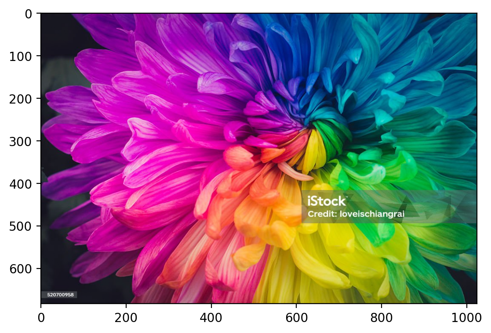
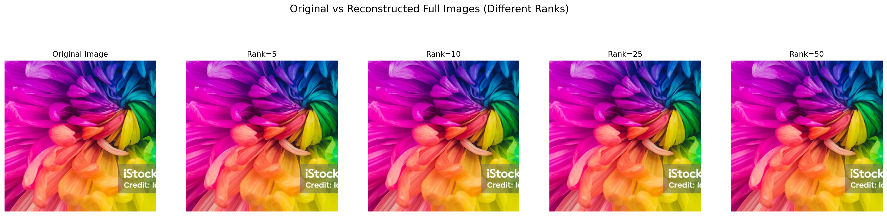
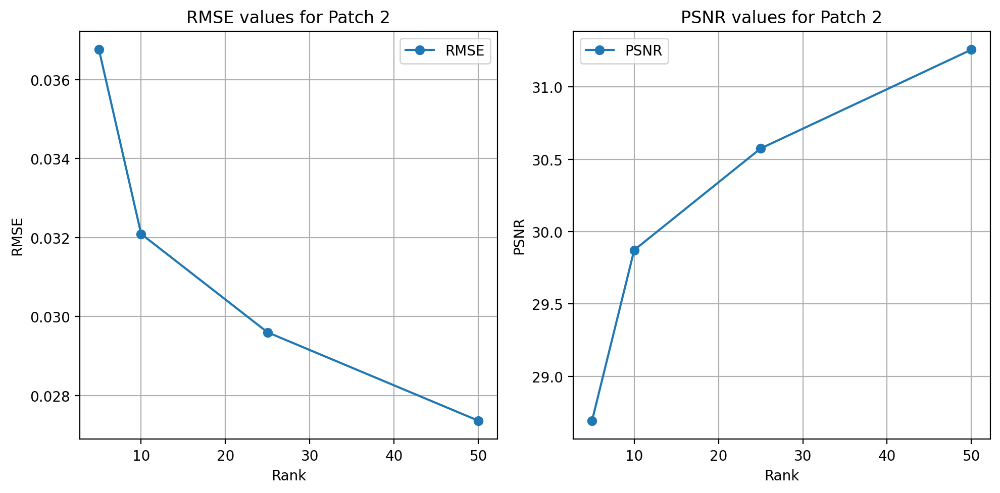
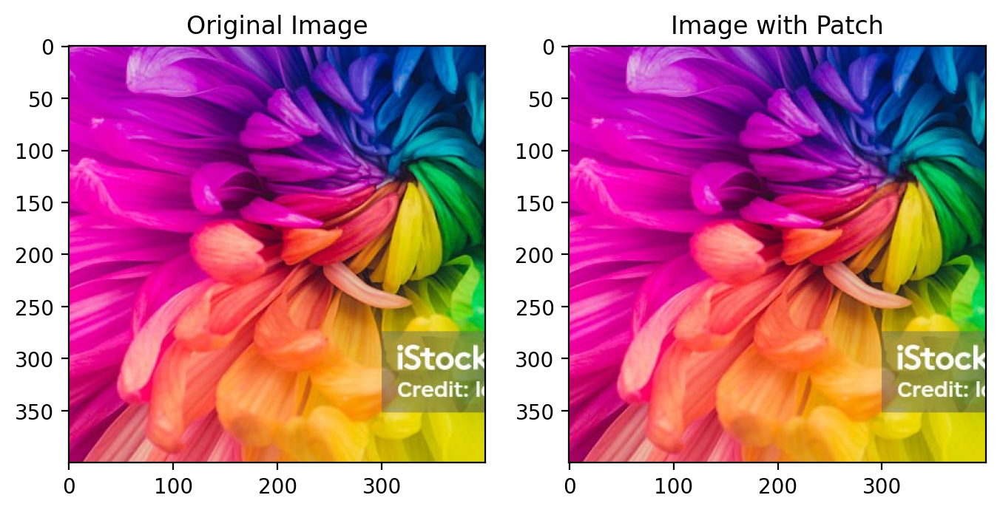
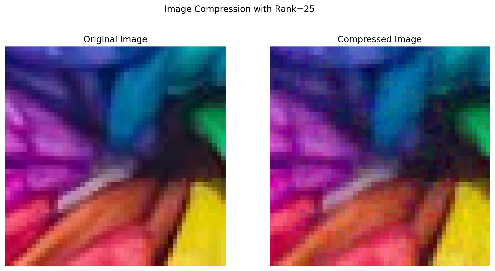

# Task-4b Data Compression using Matrix Factorization

Consider an image patch of size (50x50) that you want to compress using matrix factorization. To do this, you'll split the patch [N×N] into two smaller matrices of size [N×r] and [r×N] using matrix factorization. Compute the compressed patch by multiplying these two matrices and compare the reconstructed image patch with the original patch. Compute the Root Mean Squared Error (RMSE) and Peak Signal-to-Noise Ratio (PSNR) between the original and reconstructed image patches.
Consider the following three cases-

- a patch with mainly a single color.
- a patch with 2-3 different colors.
- a patch with at least 5 different colors.

Test different values for the low-rank r=[5,10,25,50].Use Gradient Descent to learn the compressed matrices.Display the reconstructed image patches, keeping the original pixel values outside the patch unchanged, and use your compressed matrix for the patch to show how well the reconstruction works.


### Importing Required Libraries


```python
import numpy as np
import pandas as pd
import matplotlib.pyplot as plt
import pandas as pd
import seaborn as sns
from sklearn import preprocessing
import warnings
warnings.filterwarnings('ignore')

%matplotlib inline
%config InlineBackend.figure_format = 'retina'

try:
    from einops import rearrange
except ImportError:
    %pip install einops
    from einops import rearrange
```


```python
import torch
import torch.nn as nn
import torch.nn.functional as F
import torch.optim as optim
import torchvision
device = torch.device( "cpu")
```


```python
# Setting the seed for Python, NumPy, and PyTorch (both CPU and GPU)
def set_seed(seed=42):
    np.random.seed(seed)
    torch.manual_seed(seed)
    torch.backends.cudnn.deterministic = True  # Ensures deterministic behavior
    torch.backends.cudnn.benchmark = False     # Disables the auto-tuner that finds the best algorithm

set_seed(42)
```

### Loading the image


```python
# Load and preprocess image
img = torchvision.io.read_image("./Multi_Color_Photo.jpg")
# img = torchvision.io.read_image("./dog.jpg")
img = img.to(dtype=torch.float32)  # Ensure tensor is of type float

```

### Scaling the image


```python
scaler = preprocessing.MinMaxScaler().fit(img.reshape(-1, 1))
scaler
```


<style>#sk-container-id-9 {
  /* Definition of color scheme common for light and dark mode */
  --sklearn-color-text: #000;
  --sklearn-color-text-muted: #666;
  --sklearn-color-line: gray;
  /* Definition of color scheme for unfitted estimators */
  --sklearn-color-unfitted-level-0: #fff5e6;
  --sklearn-color-unfitted-level-1: #f6e4d2;
  --sklearn-color-unfitted-level-2: #ffe0b3;
  --sklearn-color-unfitted-level-3: chocolate;
  /* Definition of color scheme for fitted estimators */
  --sklearn-color-fitted-level-0: #f0f8ff;
  --sklearn-color-fitted-level-1: #d4ebff;
  --sklearn-color-fitted-level-2: #b3dbfd;
  --sklearn-color-fitted-level-3: cornflowerblue;

  /* Specific color for light theme */
  --sklearn-color-text-on-default-background: var(--sg-text-color, var(--theme-code-foreground, var(--jp-content-font-color1, black)));
  --sklearn-color-background: var(--sg-background-color, var(--theme-background, var(--jp-layout-color0, white)));
  --sklearn-color-border-box: var(--sg-text-color, var(--theme-code-foreground, var(--jp-content-font-color1, black)));
  --sklearn-color-icon: #696969;

  @media (prefers-color-scheme: dark) {
    /* Redefinition of color scheme for dark theme */
    --sklearn-color-text-on-default-background: var(--sg-text-color, var(--theme-code-foreground, var(--jp-content-font-color1, white)));
    --sklearn-color-background: var(--sg-background-color, var(--theme-background, var(--jp-layout-color0, #111)));
    --sklearn-color-border-box: var(--sg-text-color, var(--theme-code-foreground, var(--jp-content-font-color1, white)));
    --sklearn-color-icon: #878787;
  }
}

#sk-container-id-9 {
  color: var(--sklearn-color-text);
}

#sk-container-id-9 pre {
  padding: 0;
}

#sk-container-id-9 input.sk-hidden--visually {
  border: 0;
  clip: rect(1px 1px 1px 1px);
  clip: rect(1px, 1px, 1px, 1px);
  height: 1px;
  margin: -1px;
  overflow: hidden;
  padding: 0;
  position: absolute;
  width: 1px;
}

#sk-container-id-9 div.sk-dashed-wrapped {
  border: 1px dashed var(--sklearn-color-line);
  margin: 0 0.4em 0.5em 0.4em;
  box-sizing: border-box;
  padding-bottom: 0.4em;
  background-color: var(--sklearn-color-background);
}

#sk-container-id-9 div.sk-container {
  /* jupyter's `normalize.less` sets `[hidden] { display: none; }`
     but bootstrap.min.css set `[hidden] { display: none !important; }`
     so we also need the `!important` here to be able to override the
     default hidden behavior on the sphinx rendered scikit-learn.org.
     See: https://github.com/scikit-learn/scikit-learn/issues/21755 */
  display: inline-block !important;
  position: relative;
}

#sk-container-id-9 div.sk-text-repr-fallback {
  display: none;
}

div.sk-parallel-item,
div.sk-serial,
div.sk-item {
  /* draw centered vertical line to link estimators */
  background-image: linear-gradient(var(--sklearn-color-text-on-default-background), var(--sklearn-color-text-on-default-background));
  background-size: 2px 100%;
  background-repeat: no-repeat;
  background-position: center center;
}

/* Parallel-specific style estimator block */

#sk-container-id-9 div.sk-parallel-item::after {
  content: "";
  width: 100%;
  border-bottom: 2px solid var(--sklearn-color-text-on-default-background);
  flex-grow: 1;
}

#sk-container-id-9 div.sk-parallel {
  display: flex;
  align-items: stretch;
  justify-content: center;
  background-color: var(--sklearn-color-background);
  position: relative;
}

#sk-container-id-9 div.sk-parallel-item {
  display: flex;
  flex-direction: column;
}

#sk-container-id-9 div.sk-parallel-item:first-child::after {
  align-self: flex-end;
  width: 50%;
}

#sk-container-id-9 div.sk-parallel-item:last-child::after {
  align-self: flex-start;
  width: 50%;
}

#sk-container-id-9 div.sk-parallel-item:only-child::after {
  width: 0;
}

/* Serial-specific style estimator block */

#sk-container-id-9 div.sk-serial {
  display: flex;
  flex-direction: column;
  align-items: center;
  background-color: var(--sklearn-color-background);
  padding-right: 1em;
  padding-left: 1em;
}


/* Toggleable style: style used for estimator/Pipeline/ColumnTransformer box that is
clickable and can be expanded/collapsed.
- Pipeline and ColumnTransformer use this feature and define the default style
- Estimators will overwrite some part of the style using the `sk-estimator` class
*/

/* Pipeline and ColumnTransformer style (default) */

#sk-container-id-9 div.sk-toggleable {
  /* Default theme specific background. It is overwritten whether we have a
  specific estimator or a Pipeline/ColumnTransformer */
  background-color: var(--sklearn-color-background);
}

/* Toggleable label */
#sk-container-id-9 label.sk-toggleable__label {
  cursor: pointer;
  display: flex;
  width: 100%;
  margin-bottom: 0;
  padding: 0.5em;
  box-sizing: border-box;
  text-align: center;
  align-items: start;
  justify-content: space-between;
  gap: 0.5em;
}

#sk-container-id-9 label.sk-toggleable__label .caption {
  font-size: 0.6rem;
  font-weight: lighter;
  color: var(--sklearn-color-text-muted);
}

#sk-container-id-9 label.sk-toggleable__label-arrow:before {
  /* Arrow on the left of the label */
  content: "▸";
  float: left;
  margin-right: 0.25em;
  color: var(--sklearn-color-icon);
}

#sk-container-id-9 label.sk-toggleable__label-arrow:hover:before {
  color: var(--sklearn-color-text);
}

/* Toggleable content - dropdown */

#sk-container-id-9 div.sk-toggleable__content {
  display: none;
  text-align: left;
  /* unfitted */
  background-color: var(--sklearn-color-unfitted-level-0);
}

#sk-container-id-9 div.sk-toggleable__content.fitted {
  /* fitted */
  background-color: var(--sklearn-color-fitted-level-0);
}

#sk-container-id-9 div.sk-toggleable__content pre {
  margin: 0.2em;
  border-radius: 0.25em;
  color: var(--sklearn-color-text);
  /* unfitted */
  background-color: var(--sklearn-color-unfitted-level-0);
}

#sk-container-id-9 div.sk-toggleable__content.fitted pre {
  /* unfitted */
  background-color: var(--sklearn-color-fitted-level-0);
}

#sk-container-id-9 input.sk-toggleable__control:checked~div.sk-toggleable__content {
  /* Expand drop-down */
  display: block;
  width: 100%;
  overflow: visible;
}

#sk-container-id-9 input.sk-toggleable__control:checked~label.sk-toggleable__label-arrow:before {
  content: "▾";
}

/* Pipeline/ColumnTransformer-specific style */

#sk-container-id-9 div.sk-label input.sk-toggleable__control:checked~label.sk-toggleable__label {
  color: var(--sklearn-color-text);
  background-color: var(--sklearn-color-unfitted-level-2);
}

#sk-container-id-9 div.sk-label.fitted input.sk-toggleable__control:checked~label.sk-toggleable__label {
  background-color: var(--sklearn-color-fitted-level-2);
}

/* Estimator-specific style */

/* Colorize estimator box */
#sk-container-id-9 div.sk-estimator input.sk-toggleable__control:checked~label.sk-toggleable__label {
  /* unfitted */
  background-color: var(--sklearn-color-unfitted-level-2);
}

#sk-container-id-9 div.sk-estimator.fitted input.sk-toggleable__control:checked~label.sk-toggleable__label {
  /* fitted */
  background-color: var(--sklearn-color-fitted-level-2);
}

#sk-container-id-9 div.sk-label label.sk-toggleable__label,
#sk-container-id-9 div.sk-label label {
  /* The background is the default theme color */
  color: var(--sklearn-color-text-on-default-background);
}

/* On hover, darken the color of the background */
#sk-container-id-9 div.sk-label:hover label.sk-toggleable__label {
  color: var(--sklearn-color-text);
  background-color: var(--sklearn-color-unfitted-level-2);
}

/* Label box, darken color on hover, fitted */
#sk-container-id-9 div.sk-label.fitted:hover label.sk-toggleable__label.fitted {
  color: var(--sklearn-color-text);
  background-color: var(--sklearn-color-fitted-level-2);
}

/* Estimator label */

#sk-container-id-9 div.sk-label label {
  font-family: monospace;
  font-weight: bold;
  display: inline-block;
  line-height: 1.2em;
}

#sk-container-id-9 div.sk-label-container {
  text-align: center;
}

/* Estimator-specific */
#sk-container-id-9 div.sk-estimator {
  font-family: monospace;
  border: 1px dotted var(--sklearn-color-border-box);
  border-radius: 0.25em;
  box-sizing: border-box;
  margin-bottom: 0.5em;
  /* unfitted */
  background-color: var(--sklearn-color-unfitted-level-0);
}

#sk-container-id-9 div.sk-estimator.fitted {
  /* fitted */
  background-color: var(--sklearn-color-fitted-level-0);
}

/* on hover */
#sk-container-id-9 div.sk-estimator:hover {
  /* unfitted */
  background-color: var(--sklearn-color-unfitted-level-2);
}

#sk-container-id-9 div.sk-estimator.fitted:hover {
  /* fitted */
  background-color: var(--sklearn-color-fitted-level-2);
}

/* Specification for estimator info (e.g. "i" and "?") */

/* Common style for "i" and "?" */

.sk-estimator-doc-link,
a:link.sk-estimator-doc-link,
a:visited.sk-estimator-doc-link {
  float: right;
  font-size: smaller;
  line-height: 1em;
  font-family: monospace;
  background-color: var(--sklearn-color-background);
  border-radius: 1em;
  height: 1em;
  width: 1em;
  text-decoration: none !important;
  margin-left: 0.5em;
  text-align: center;
  /* unfitted */
  border: var(--sklearn-color-unfitted-level-1) 1pt solid;
  color: var(--sklearn-color-unfitted-level-1);
}

.sk-estimator-doc-link.fitted,
a:link.sk-estimator-doc-link.fitted,
a:visited.sk-estimator-doc-link.fitted {
  /* fitted */
  border: var(--sklearn-color-fitted-level-1) 1pt solid;
  color: var(--sklearn-color-fitted-level-1);
}

/* On hover */
div.sk-estimator:hover .sk-estimator-doc-link:hover,
.sk-estimator-doc-link:hover,
div.sk-label-container:hover .sk-estimator-doc-link:hover,
.sk-estimator-doc-link:hover {
  /* unfitted */
  background-color: var(--sklearn-color-unfitted-level-3);
  color: var(--sklearn-color-background);
  text-decoration: none;
}

div.sk-estimator.fitted:hover .sk-estimator-doc-link.fitted:hover,
.sk-estimator-doc-link.fitted:hover,
div.sk-label-container:hover .sk-estimator-doc-link.fitted:hover,
.sk-estimator-doc-link.fitted:hover {
  /* fitted */
  background-color: var(--sklearn-color-fitted-level-3);
  color: var(--sklearn-color-background);
  text-decoration: none;
}

/* Span, style for the box shown on hovering the info icon */
.sk-estimator-doc-link span {
  display: none;
  z-index: 9999;
  position: relative;
  font-weight: normal;
  right: .2ex;
  padding: .5ex;
  margin: .5ex;
  width: min-content;
  min-width: 20ex;
  max-width: 50ex;
  color: var(--sklearn-color-text);
  box-shadow: 2pt 2pt 4pt #999;
  /* unfitted */
  background: var(--sklearn-color-unfitted-level-0);
  border: .5pt solid var(--sklearn-color-unfitted-level-3);
}

.sk-estimator-doc-link.fitted span {
  /* fitted */
  background: var(--sklearn-color-fitted-level-0);
  border: var(--sklearn-color-fitted-level-3);
}

.sk-estimator-doc-link:hover span {
  display: block;
}

/* "?"-specific style due to the `<a>` HTML tag */

#sk-container-id-9 a.estimator_doc_link {
  float: right;
  font-size: 1rem;
  line-height: 1em;
  font-family: monospace;
  background-color: var(--sklearn-color-background);
  border-radius: 1rem;
  height: 1rem;
  width: 1rem;
  text-decoration: none;
  /* unfitted */
  color: var(--sklearn-color-unfitted-level-1);
  border: var(--sklearn-color-unfitted-level-1) 1pt solid;
}

#sk-container-id-9 a.estimator_doc_link.fitted {
  /* fitted */
  border: var(--sklearn-color-fitted-level-1) 1pt solid;
  color: var(--sklearn-color-fitted-level-1);
}

/* On hover */
#sk-container-id-9 a.estimator_doc_link:hover {
  /* unfitted */
  background-color: var(--sklearn-color-unfitted-level-3);
  color: var(--sklearn-color-background);
  text-decoration: none;
}

#sk-container-id-9 a.estimator_doc_link.fitted:hover {
  /* fitted */
  background-color: var(--sklearn-color-fitted-level-3);
}

.estimator-table summary {
    padding: .5rem;
    font-family: monospace;
    cursor: pointer;
}

.estimator-table details[open] {
    padding-left: 0.1rem;
    padding-right: 0.1rem;
    padding-bottom: 0.3rem;
}

.estimator-table .parameters-table {
    margin-left: auto !important;
    margin-right: auto !important;
}

.estimator-table .parameters-table tr:nth-child(odd) {
    background-color: #fff;
}

.estimator-table .parameters-table tr:nth-child(even) {
    background-color: #f6f6f6;
}

.estimator-table .parameters-table tr:hover {
    background-color: #e0e0e0;
}

.estimator-table table td {
    border: 1px solid rgba(106, 105, 104, 0.232);
}

.user-set td {
    color:rgb(255, 94, 0);
    text-align: left;
}

.user-set td.value pre {
    color:rgb(255, 94, 0) !important;
    background-color: transparent !important;
}

.default td {
    color: black;
    text-align: left;
}

.user-set td i,
.default td i {
    color: black;
}

.copy-paste-icon {
    background-image: url(data:image/svg+xml;base64,PHN2ZyB4bWxucz0iaHR0cDovL3d3dy53My5vcmcvMjAwMC9zdmciIHZpZXdCb3g9IjAgMCA0NDggNTEyIj48IS0tIUZvbnQgQXdlc29tZSBGcmVlIDYuNy4yIGJ5IEBmb250YXdlc29tZSAtIGh0dHBzOi8vZm9udGF3ZXNvbWUuY29tIExpY2Vuc2UgLSBodHRwczovL2ZvbnRhd2Vzb21lLmNvbS9saWNlbnNlL2ZyZWUgQ29weXJpZ2h0IDIwMjUgRm9udGljb25zLCBJbmMuLS0+PHBhdGggZD0iTTIwOCAwTDMzMi4xIDBjMTIuNyAwIDI0LjkgNS4xIDMzLjkgMTQuMWw2Ny45IDY3LjljOSA5IDE0LjEgMjEuMiAxNC4xIDMzLjlMNDQ4IDMzNmMwIDI2LjUtMjEuNSA0OC00OCA0OGwtMTkyIDBjLTI2LjUgMC00OC0yMS41LTQ4LTQ4bDAtMjg4YzAtMjYuNSAyMS41LTQ4IDQ4LTQ4ek00OCAxMjhsODAgMCAwIDY0LTY0IDAgMCAyNTYgMTkyIDAgMC0zMiA2NCAwIDAgNDhjMCAyNi41LTIxLjUgNDgtNDggNDhMNDggNTEyYy0yNi41IDAtNDgtMjEuNS00OC00OEwwIDE3NmMwLTI2LjUgMjEuNS00OCA0OC00OHoiLz48L3N2Zz4=);
    background-repeat: no-repeat;
    background-size: 14px 14px;
    background-position: 0;
    display: inline-block;
    width: 14px;
    height: 14px;
    cursor: pointer;
}
</style><body><div id="sk-container-id-9" class="sk-top-container"><div class="sk-text-repr-fallback"><pre>MinMaxScaler()</pre><b>In a Jupyter environment, please rerun this cell to show the HTML representation or trust the notebook. <br />On GitHub, the HTML representation is unable to render, please try loading this page with nbviewer.org.</b></div><div class="sk-container" hidden><div class="sk-item"><div class="sk-estimator fitted sk-toggleable"><input class="sk-toggleable__control sk-hidden--visually" id="sk-estimator-id-9" type="checkbox" checked><label for="sk-estimator-id-9" class="sk-toggleable__label fitted sk-toggleable__label-arrow"><div><div>MinMaxScaler</div></div><div><a class="sk-estimator-doc-link fitted" rel="noreferrer" target="_blank" href="https://scikit-learn.org/1.7/modules/generated/sklearn.preprocessing.MinMaxScaler.html">?<span>Documentation for MinMaxScaler</span></a><span class="sk-estimator-doc-link fitted">i<span>Fitted</span></span></div></label><div class="sk-toggleable__content fitted" data-param-prefix="">
        <div class="estimator-table">
            <details>
                <summary>Parameters</summary>
                <table class="parameters-table">
                  <tbody>

        <tr class="default">
            <td><i class="copy-paste-icon"
                 onclick="copyToClipboard('feature_range',
                          this.parentElement.nextElementSibling)"
            ></i></td>
            <td class="param">feature_range&nbsp;</td>
            <td class="value">(0, ...)</td>
        </tr>


        <tr class="default">
            <td><i class="copy-paste-icon"
                 onclick="copyToClipboard('copy',
                          this.parentElement.nextElementSibling)"
            ></i></td>
            <td class="param">copy&nbsp;</td>
            <td class="value">True</td>
        </tr>


        <tr class="default">
            <td><i class="copy-paste-icon"
                 onclick="copyToClipboard('clip',
                          this.parentElement.nextElementSibling)"
            ></i></td>
            <td class="param">clip&nbsp;</td>
            <td class="value">False</td>
        </tr>

                  </tbody>
                </table>
            </details>
        </div>
    </div></div></div></div></div><script>function copyToClipboard(text, element) {
    // Get the parameter prefix from the closest toggleable content
    const toggleableContent = element.closest('.sk-toggleable__content');
    const paramPrefix = toggleableContent ? toggleableContent.dataset.paramPrefix : '';
    const fullParamName = paramPrefix ? `${paramPrefix}${text}` : text;

    const originalStyle = element.style;
    const computedStyle = window.getComputedStyle(element);
    const originalWidth = computedStyle.width;
    const originalHTML = element.innerHTML.replace('Copied!', '');

    navigator.clipboard.writeText(fullParamName)
        .then(() => {
            element.style.width = originalWidth;
            element.style.color = 'green';
            element.innerHTML = "Copied!";

            setTimeout(() => {
                element.innerHTML = originalHTML;
                element.style = originalStyle;
            }, 2000);
        })
        .catch(err => {
            console.error('Failed to copy:', err);
            element.style.color = 'red';
            element.innerHTML = "Failed!";
            setTimeout(() => {
                element.innerHTML = originalHTML;
                element.style = originalStyle;
            }, 2000);
        });
    return false;
}

document.querySelectorAll('.fa-regular.fa-copy').forEach(function(element) {
    const toggleableContent = element.closest('.sk-toggleable__content');
    const paramPrefix = toggleableContent ? toggleableContent.dataset.paramPrefix : '';
    const paramName = element.parentElement.nextElementSibling.textContent.trim();
    const fullParamName = paramPrefix ? `${paramPrefix}${paramName}` : paramName;

    element.setAttribute('title', fullParamName);
});
</script></body>


```python
img_scaled = scaler.transform(img.reshape(-1, 1)).reshape(img.shape)
img_scaled = torch.tensor(img_scaled)
print(img_scaled.shape)
plt.imshow(img_scaled.permute(1, 2, 0))
```

    torch.Size([3, 683, 1024])
    


    <matplotlib.image.AxesImage at 0x16f9b2a1820>


    

    


### Croppping the image


```python
crop = torchvision.transforms.CenterCrop(400)
crop = crop(img_scaled)
print(crop.shape)
plt.imshow(crop.permute(1, 2, 0))
```

    torch.Size([3, 400, 400])
    


    <matplotlib.image.AxesImage at 0x16f9b0c75f0>


    

    


### Extract a 50x50 patch from the image


```python
def extract_patch(crop, patch_size=50, top_left_x=0, top_left_y=0, border_color=torch.tensor([1.0, 0.0, 0.0]), border_thickness=1):
    channels, height, width = crop.shape

    if patch_size > height or patch_size > width:
        raise ValueError("Patch size must be smaller than the dimensions of the image.")

    patch = crop[:, top_left_x:top_left_x + patch_size, top_left_y:top_left_y + patch_size]

    img_with_border = crop.clone()
    img_with_border[:, top_left_x:top_left_x + border_thickness, top_left_y:top_left_y + patch_size] = border_color[:, None, None]
    img_with_border[:, top_left_x + patch_size - border_thickness:top_left_x + patch_size, top_left_y:top_left_y + patch_size] = border_color[:, None, None]
    img_with_border[:, top_left_x:top_left_x + patch_size, top_left_y:top_left_y + border_thickness] = border_color[:, None, None]
    img_with_border[:, top_left_x:top_left_x + patch_size, top_left_y + patch_size - border_thickness:top_left_y + patch_size] = border_color[:, None, None]

    print("Shape of the patch:", patch.shape)
    plt.figure(figsize=(8, 8))
    plt.subplot(1, 2, 1)
    plt.imshow(rearrange(patch, 'c h w -> h w c').cpu().numpy())
    plt.title("Patch")
    plt.subplot(1, 2, 2)
    plt.imshow(rearrange(img_with_border, 'c h w -> h w c').cpu().numpy())
    plt.title("Image with border")
    plt.show()

    return patch, img_with_border


```

### HELPER Functions 


```python
# -----------------------------------------------------
# 1. GRADIENT DESCENT BASED MATRIX FACTORIZATION
# -----------------------------------------------------
def matrix_factorization_gradient(image_tensor, r=20, lr=0.01, steps=5000, tol=1e-6, device=torch.device("cpu")):
    """
    Perform matrix factorization on masked image using gradient descent (Adam).

    Args:
        M (torch.Tensor): Masked image tensor of shape (C, H, W)
        r (int): Rank for low-rank approximation
        lr (float): Learning rate
        steps (int): Number of iterations
        tol (float): Tolerance for early stopping
        device (torch.device): CPU or CUDA device

    Returns:
        W_list (torch.Tensor): Factor matrix W (C, H, r)
        H_list (torch.Tensor): Factor matrix H (C, r, W)
        loss_list (list): Loss values per channel
    """
    C, H, W = image_tensor.shape
    image_tensor = image_tensor.to(device, dtype=torch.float32)

    W_list = torch.empty(C, H, r, device=device)
    H_list = torch.empty(C, r, W, device=device)
    loss_list = [[] for _ in range(C)]
    reconstructed_channels = []

    for c in range(C):
        M_channel = image_tensor[c].clone()

        # Initialize factors
        U = torch.rand(H, r, device=device, requires_grad=True)
        V = torch.rand(r, W, device=device, requires_grad=True)

        optimizer = optim.Adam([U, V], lr=lr)
        prev_loss = float('inf')

        for step in range(1, steps + 1):
            optimizer.zero_grad()

            M_pred = U @ V
            # M_pred_clamped = torch.clamp(U @ V, 0.0, 1.0)
            loss = F.mse_loss(M_pred, M_channel)

            loss.backward()
            optimizer.step()

            loss_list[c].append(loss.item())

            # Print occasionally
            if step % 1000 == 0:
                print(f"Channel {c}, Step {step}, Loss={loss.item():.6f}")

            # Early stop
            if abs(prev_loss - loss.item()) < tol:
                print(f"Channel {c} converged at step {step}, loss={loss.item():.6f}")
                break
            prev_loss = loss.item()

        W_list[c] = U.detach()
        H_list[c] = V.detach()
        reconstructed_channels.append((U @ V).detach())

    reconstructed_img = torch.stack(reconstructed_channels, dim=0)
    # reconstructed_img = torch.clamp(reconstructed_img, 0, 1)

    return reconstructed_img, W_list, H_list, loss_list


# -----------------------------------------------------
# 2. PLOT RESULTS
# -----------------------------------------------------
def plot_result(original_img, reconstructed_img, rank):
    fig, axes = plt.subplots(1, 2, figsize=(12, 6))
    fig.suptitle(f"Image Compression with Rank={rank}")

    # Original image
    axes[0].imshow(rearrange(original_img, 'c h w -> h w c').cpu().numpy())
    axes[0].set_title("Original Image")
    axes[0].axis('off')

    # Reconstructed image
    axes[1].imshow(rearrange(reconstructed_img, 'c h w -> h w c').cpu().detach().numpy())
    axes[1].set_title("Compressed Image")
    axes[1].axis('off')

    plt.show()


# -----------------------------------------------------
# 3. RMSE + PSNR METRICS
# -----------------------------------------------------
def calculate_rmse_psnr(original_img, reconstructed_img):
    if original_img.device != reconstructed_img.device:
        original_img = original_img.to(reconstructed_img.device)

    mse = F.mse_loss(reconstructed_img, original_img)
    rmse = torch.sqrt(mse)
    psnr = 20 * torch.log10(1.0 / rmse)
    print(f"RMSE: {rmse.item():.6f}, PSNR: {psnr.item():.6f}")
    return rmse.item(), psnr.item()


# -----------------------------------------------------
# 4. FULL IMAGE RECONSTRUCTION PIPELINE
# -----------------------------------------------------
def image_reconstruction_matrix(img, rank=20, learning_rate=0.01, num_epochs=5000,
                                tol=1e-6, plot=True, device=torch.device("cpu")):
    img = img.to(torch.float32).to(device)
    
    # Perform matrix factorization
    # Compute metrics (without clamping)
    reconstructed_img, W, H, loss_list = matrix_factorization_gradient(
        img, r=rank, lr=learning_rate, steps=num_epochs, tol=tol, device=device
    )
    rmse, psnr = calculate_rmse_psnr(img, reconstructed_img)

    if plot:
        plot_result(img, reconstructed_img, rank)

    return reconstructed_img, W, H, loss_list, rmse, psnr


# -----------------------------------------------------
# 5. HELPER FUNCTION TO DISPLAY PATCHES
# -----------------------------------------------------
def display_patches(original, reconstructed, rank):
    fig, axs = plt.subplots(1, 2, figsize=(8, 8))
    axs[0].imshow(rearrange(original, 'c h w -> h w c').cpu().numpy())
    axs[0].set_title(f'Original Patch (rank={rank})')
    axs[1].imshow(rearrange(reconstructed, 'c h w -> h w c').cpu().detach().numpy())
    axs[1].set_title(f'Reconstructed Patch (rank={rank})')
    plt.show()

# -----------------------------------------------------
# 6. PLOT (RMSE AND PSNR) VS RANK TRENDS
# -----------------------------------------------------
def plot_rmse_psnr(ranks, rmse_values, psnr_values, patch_id):
    # Create subplots for RMSE and PSNR values
    fig, axs = plt.subplots(1, 2, figsize=(10, 5))

    # Plot RMSE values
    axs[0].plot(ranks, rmse_values, marker='o', label='RMSE')
    axs[0].set_xlabel('Rank')
    axs[0].set_ylabel('RMSE')
    axs[0].set_title(f'RMSE values for Patch {patch_id}')
    axs[0].legend()
    axs[0].grid()

    # Plot PSNR values
    axs[1].plot(ranks, psnr_values, marker='o', label='PSNR')
    axs[1].set_xlabel('Rank')
    axs[1].set_ylabel('PSNR')
    axs[1].set_title(f'PSNR values for Patch {patch_id}')
    axs[1].legend()
    axs[1].grid()

    plt.tight_layout()
    plt.show()

# -----------------------------------------------------
# 7. ADD PATCH TO IMAGE
# -----------------------------------------------------
def add_patch_to_image(image_tensor, patch, top_left_x, top_left_y):
    channels, height, width = image_tensor.shape
    patch_size = patch.shape[1]

    if top_left_x + patch_size > height or top_left_y + patch_size > width:
        raise ValueError("Patch does not fit within the image dimensions.")

    image_with_patch = image_tensor.clone()
    image_with_patch[:, top_left_x:top_left_x + patch_size, top_left_y:top_left_y + patch_size] = patch

    fig, axs = plt.subplots(1, 2, figsize=(8, 8))
    axs[0].imshow(rearrange(image_tensor, 'c h w -> h w c').cpu().detach().numpy())
    axs[0].set_title("Original Image")
    axs[1].imshow(rearrange(image_with_patch, 'c h w -> h w c').cpu().detach().numpy())
    axs[1].set_title("Image with Patch")
    plt.show()

    return image_with_patch
```


```python
# def compress_color_image(image_tensor, rank, learning_rate=0.01, num_epochs=5000, tol=1e-6, device=torch.device("cpu")):
#     # channels, height, width = image_tensor.shape
#     # compressed_img = torch.zeros(channels, height, width, device=device)

#     image_tensor = image_tensor.to(device)
#     R_channel = image_tensor[0].to(device).float()
#     G_channel = image_tensor[1].to(device).float()
#     B_channel = image_tensor[2].to(device).float()

#     print("Factorizing the R channel...")
#     W_R, H_R, loss_R, _ = matrix_factorization(R_channel, rank, learning_rate, num_epochs, tol, device)
#     print("Factorizing the G channel...")
#     W_G, H_G, loss_G, _ = matrix_factorization(G_channel, rank, learning_rate, num_epochs, tol, device)
#     print("Factorizing the B channel...")
#     W_B, H_B, loss_B, _ = matrix_factorization(B_channel, rank, learning_rate, num_epochs, tol, device)

#     compressed_img = torch.stack([torch.matmul(W_R, H_R), torch.matmul(W_G, H_G), torch.matmul(W_B, H_B)], dim=0)

#     return compressed_img, (loss_R, loss_G, loss_B)
```


```python
# def compress_compare_evaluate(image_tensor, rank, learning_rate=0.01, num_epochs=5000, tol=1e-6, device=torch.device("cpu")):
#     compressed_img, color_loss = compress_color_image(image_tensor, rank, learning_rate, num_epochs, tol, device)

#     rmse, psnr = calculate_rmse_psnr(image_tensor, compressed_img)
#     print(f"\nRMSE: {rmse:.6f}")
#     print(f"PSNR: {psnr:.6f}")

#     display_patches(image_tensor, compressed_img, rank)

#     return compressed_img, color_loss, rmse, psnr
```

## Patch Selection


```python
patch_size = 50
print("_" * 100)
print("Patch 1 with single color:")
patch1, img1 = extract_patch(crop, patch_size, top_left_x=0, top_left_y=0)      # Single-color
print("_" * 100)
print("Patch 2 with 2 colors:")
patch2, img2 = extract_patch(crop, patch_size, top_left_x=170, top_left_y=330)   # 2–3 colors
print("_" * 100)
print("Patch 3 with 5+ colors:")
patch3, img3 = extract_patch(crop, patch_size, top_left_x=100, top_left_y=283)  # 5+ colors
```

    ____________________________________________________________________________________________________
    Patch 1 with single color:
    Shape of the patch: torch.Size([3, 50, 50])
    


    

    


    ____________________________________________________________________________________________________
    Patch 2 with 2 colors:
    Shape of the patch: torch.Size([3, 50, 50])
    


    

    


    ____________________________________________________________________________________________________
    Patch 3 with 5+ colors:
    Shape of the patch: torch.Size([3, 50, 50])
    


    

    


## Patch 1


```python
ranks = [5, 10, 25, 50]
rmse_values_1 = []
psnr_values_1 = []
for rank in ranks:
    print("_" * 100)
    print(f"\n\nRank: {rank}")
    reconstructed_patch_1, W, H, loss_list, rmse_1, psnr_1 = image_reconstruction_matrix(
        patch1, rank=rank, learning_rate=1e-2, num_epochs=5000
    )
    rmse_values_1.append(rmse_1)
    psnr_values_1.append(psnr_1)
    top_left_x, top_left_y = 0, 0
    img_with_patch_1 = add_patch_to_image(crop, reconstructed_patch_1, top_left_x, top_left_y)
```

    ____________________________________________________________________________________________________
    
    
    Rank: 5
    Channel 0 converged at step 538, loss=0.000615
    Channel 1, Step 1000, Loss=0.000716
    Channel 1 converged at step 1143, loss=0.000541
    Channel 2 converged at step 383, loss=0.000890
    RMSE: 0.026093, PSNR: 31.669529
    

    Clipping input data to the valid range for imshow with RGB data ([0..1] for floats or [0..255] for integers). Got range [-0.05866415..0.96756566].
    


    

    


    Clipping input data to the valid range for imshow with RGB data ([0..1] for floats or [0..255] for integers). Got range [-0.05866415053606033..1.0].
    


    

    


    ____________________________________________________________________________________________________
    
    
    Rank: 10
    Channel 0 converged at step 967, loss=0.000758
    Channel 1, Step 1000, Loss=0.001186
    Channel 1 converged at step 1397, loss=0.000662
    

    Clipping input data to the valid range for imshow with RGB data ([0..1] for floats or [0..255] for integers). Got range [-0.05947916..0.92217594].
    

    Channel 2 converged at step 722, loss=0.000868
    RMSE: 0.027598, PSNR: 31.182388
    


    

    


    Clipping input data to the valid range for imshow with RGB data ([0..1] for floats or [0..255] for integers). Got range [-0.059479158371686935..1.0].
    


    

    


    ____________________________________________________________________________________________________
    
    
    Rank: 25
    Channel 0, Step 1000, Loss=0.001964
    Channel 0 converged at step 1465, loss=0.000813
    Channel 1, Step 1000, Loss=0.002316
    Channel 1 converged at step 1605, loss=0.000721
    

    Clipping input data to the valid range for imshow with RGB data ([0..1] for floats or [0..255] for integers). Got range [-0.0895432..0.9660532].
    

    Channel 2, Step 1000, Loss=0.001544
    Channel 2 converged at step 1377, loss=0.000728
    RMSE: 0.027443, PSNR: 31.231449
    


    

    


    Clipping input data to the valid range for imshow with RGB data ([0..1] for floats or [0..255] for integers). Got range [-0.08954320102930069..1.0].
    


    

    


    ____________________________________________________________________________________________________
    
    
    Rank: 50
    Channel 0, Step 1000, Loss=0.006656
    Channel 0, Step 2000, Loss=0.000628
    Channel 0 converged at step 2007, loss=0.000621
    Channel 1, Step 1000, Loss=0.008263
    Channel 1, Step 2000, Loss=0.000919
    Channel 1 converged at step 2207, loss=0.000664
    Channel 2, Step 1000, Loss=0.007431
    

    Clipping input data to the valid range for imshow with RGB data ([0..1] for floats or [0..255] for integers). Got range [-0.09275755..0.97218025].
    

    Channel 2, Step 2000, Loss=0.000763
    Channel 2 converged at step 2106, loss=0.000644
    RMSE: 0.025333, PSNR: 31.926271
    


    

    


    Clipping input data to the valid range for imshow with RGB data ([0..1] for floats or [0..255] for integers). Got range [-0.09275755286216736..1.0].
    


    

    


```python
plot_rmse_psnr(ranks, rmse_values_1, psnr_values_1, patch_id=1)
```


    

    


## Patch-2


```python
ranks = [5, 10, 25, 50]
rmse_values_2 = []
psnr_values_2 = []
for rank in ranks:
    print("_" * 100)
    print(f"\n\nRank: {rank}")
    reconstructed_patch_2, W, H, loss_list, rmse_2, psnr_2 = image_reconstruction_matrix(
        patch2, rank=rank, learning_rate=1e-2, num_epochs=5000
    )
    rmse_values_2.append(rmse_2)
    psnr_values_2.append(psnr_2)
    top_left_x, top_left_y = 170, 330
    img_with_patch_2 = add_patch_to_image(crop, reconstructed_patch_2, top_left_x, top_left_y)
```

    ____________________________________________________________________________________________________
    
    
    Rank: 5
    Channel 0, Step 1000, Loss=0.001761
    Channel 0 converged at step 1322, loss=0.001321
    Channel 1 converged at step 851, loss=0.001700
    

    Clipping input data to the valid range for imshow with RGB data ([0..1] for floats or [0..255] for integers). Got range [-0.085946366..0.9209747].
    

    Channel 2 converged at step 657, loss=0.001018
    RMSE: 0.036683, PSNR: 28.710768
    


    

    


    Clipping input data to the valid range for imshow with RGB data ([0..1] for floats or [0..255] for integers). Got range [-0.08594636619091034..1.0].
    


    

    


    ____________________________________________________________________________________________________
    
    
    Rank: 10
    Channel 0, Step 1000, Loss=0.001653
    Channel 0 converged at step 1506, loss=0.000957
    Channel 1, Step 1000, Loss=0.001671
    Channel 1 converged at step 1536, loss=0.000761
    

    Clipping input data to the valid range for imshow with RGB data ([0..1] for floats or [0..255] for integers). Got range [-0.047744077..0.9168237].
    

    Channel 2 converged at step 907, loss=0.000869
    RMSE: 0.029345, PSNR: 30.649189
    


    

    


    Clipping input data to the valid range for imshow with RGB data ([0..1] for floats or [0..255] for integers). Got range [-0.04774407669901848..1.0].
    


    

    


    ____________________________________________________________________________________________________
    
    
    Rank: 25
    Channel 0, Step 1000, Loss=0.004591
    Channel 0 converged at step 1953, loss=0.000837
    Channel 1, Step 1000, Loss=0.003986
    Channel 1, Step 2000, Loss=0.000954
    Channel 1 converged at step 2075, loss=0.000875
    Channel 2, Step 1000, Loss=0.002591
    Channel 2 converged at step 1596, loss=0.000853
    RMSE: 0.029225, PSNR: 30.685009
    

    Clipping input data to the valid range for imshow with RGB data ([0..1] for floats or [0..255] for integers). Got range [-0.09514537..0.9317188].
    


    

    


    Clipping input data to the valid range for imshow with RGB data ([0..1] for floats or [0..255] for integers). Got range [-0.09514536708593369..1.0].
    


    

    


    ____________________________________________________________________________________________________
    
    
    Rank: 50
    Channel 0, Step 1000, Loss=0.009382
    Channel 0, Step 2000, Loss=0.001188
    Channel 0 converged at step 2302, loss=0.000785
    Channel 1, Step 1000, Loss=0.008220
    Channel 1, Step 2000, Loss=0.001068
    Channel 1 converged at step 2258, loss=0.000734
    Channel 2, Step 1000, Loss=0.007362
    

    Clipping input data to the valid range for imshow with RGB data ([0..1] for floats or [0..255] for integers). Got range [-0.07525571..0.9245172].
    

    Channel 2, Step 2000, Loss=0.000769
    Channel 2 converged at step 2071, loss=0.000692
    RMSE: 0.027133, PSNR: 31.330164
    


    

    


    Clipping input data to the valid range for imshow with RGB data ([0..1] for floats or [0..255] for integers). Got range [-0.07525570690631866..1.0].
    


    

    


```python
plot_rmse_psnr(ranks, rmse_values_2, psnr_values_2, patch_id=2)
```


    

    


## Patch-3


```python
ranks = [5, 10, 25, 50]
rmse_values_3 = []
psnr_values_3 = []
for rank in ranks:
    print("_" * 100)
    print(f"\n\nRank: {rank}")
    reconstructed_patch_3, W, H, loss_list, rmse_3, psnr_3 = image_reconstruction_matrix(
        patch3, rank=rank, learning_rate=1e-2, num_epochs=5000
    )
    rmse_values_3.append(rmse_3)
    psnr_values_3.append(psnr_3)
    top_left_x, top_left_y = 100, 283
    img_with_patch_3 = add_patch_to_image(crop, reconstructed_patch_3, top_left_x, top_left_y)
```

    ____________________________________________________________________________________________________
    
    
    Rank: 5
    Channel 0 converged at step 911, loss=0.003369
    Channel 1, Step 1000, Loss=0.005540
    Channel 1 converged at step 1186, loss=0.005197
    

    Clipping input data to the valid range for imshow with RGB data ([0..1] for floats or [0..255] for integers). Got range [-0.05971014..1.0365453].
    

    Channel 2 converged at step 903, loss=0.003844
    RMSE: 0.064309, PSNR: 23.834587
    


    

    


    Clipping input data to the valid range for imshow with RGB data ([0..1] for floats or [0..255] for integers). Got range [-0.05971014127135277..1.0365452766418457].
    


    

    


    ____________________________________________________________________________________________________
    
    
    Rank: 10
    Channel 0, Step 1000, Loss=0.003585
    Channel 0 converged at step 1687, loss=0.001703
    Channel 1, Step 1000, Loss=0.004540
    Channel 1 converged at step 1726, loss=0.001806
    

    Clipping input data to the valid range for imshow with RGB data ([0..1] for floats or [0..255] for integers). Got range [-0.056449518..1.0108721].
    

    Channel 2, Step 1000, Loss=0.002875
    Channel 2 converged at step 1603, loss=0.001484
    RMSE: 0.040786, PSNR: 27.789709
    


    

    


    Clipping input data to the valid range for imshow with RGB data ([0..1] for floats or [0..255] for integers). Got range [-0.056449517607688904..1.0108721256256104].
    


    

    


    ____________________________________________________________________________________________________
    
    
    Rank: 25
    Channel 0, Step 1000, Loss=0.005509
    Channel 0, Step 2000, Loss=0.001498
    Channel 0 converged at step 2402, loss=0.000967
    Channel 1, Step 1000, Loss=0.006776
    Channel 1, Step 2000, Loss=0.001697
    Channel 1 converged at step 2499, loss=0.001018
    Channel 2, Step 1000, Loss=0.005684
    

    Clipping input data to the valid range for imshow with RGB data ([0..1] for floats or [0..255] for integers). Got range [-0.051913563..1.0436265].
    

    Channel 2, Step 2000, Loss=0.001386
    Channel 2 converged at step 2241, loss=0.001104
    RMSE: 0.032076, PSNR: 29.876266
    


    

    


    Clipping input data to the valid range for imshow with RGB data ([0..1] for floats or [0..255] for integers). Got range [-0.051913563162088394..1.0436265468597412].
    


    

    


    ____________________________________________________________________________________________________
    
    
    Rank: 50
    Channel 0, Step 1000, Loss=0.010227
    Channel 0, Step 2000, Loss=0.001517
    Channel 0 converged at step 2473, loss=0.000831
    Channel 1, Step 1000, Loss=0.010651
    Channel 1, Step 2000, Loss=0.001710
    Channel 1 converged at step 2571, loss=0.000830
    Channel 2, Step 1000, Loss=0.010115
    Channel 2, Step 2000, Loss=0.001925
    

    Clipping input data to the valid range for imshow with RGB data ([0..1] for floats or [0..255] for integers). Got range [-0.060009062..1.0249729].
    

    Channel 2 converged at step 2631, loss=0.000985
    RMSE: 0.029682, PSNR: 30.550005
    


    

    


    Clipping input data to the valid range for imshow with RGB data ([0..1] for floats or [0..255] for integers). Got range [-0.06000906229019165..1.024972915649414].
    


    

    


```python
plot_rmse_psnr(ranks, rmse_values_3, psnr_values_3, patch_id=3)
```


    

    


```python
def plot_rmse_psnr_multiple_patches(ranks, rmse_values_list, psnr_values_list, patch_ids):
    """
    Plot RMSE and PSNR vs Rank for multiple patches on the same graphs.
    
    Args:
        ranks (list): List of ranks used for compression.
        rmse_values_list (list of lists): RMSE values for each patch (e.g. [rmse_patch1, rmse_patch2, rmse_patch3])
        psnr_values_list (list of lists): PSNR values for each patch.
        patch_ids (list): List of patch IDs (for legends).
    """
    fig, axs = plt.subplots(1, 2, figsize=(12, 6))
    
    # Plot RMSE for all patches
    for rmse_values, pid in zip(rmse_values_list, patch_ids):
        axs[0].plot(ranks, rmse_values, marker='o', label=f'Patch {pid}')
    axs[0].set_xlabel('Rank')
    axs[0].set_ylabel('RMSE')
    axs[0].set_title('RMSE vs Rank (All Patches)')
    axs[0].legend()
    axs[0].grid()

    # Plot PSNR for all patches
    for psnr_values, pid in zip(psnr_values_list, patch_ids):
        axs[1].plot(ranks, psnr_values, marker='o', label=f'Patch {pid}')
    axs[1].set_xlabel('Rank')
    axs[1].set_ylabel('PSNR')
    axs[1].set_title('PSNR vs Rank (All Patches)')
    axs[1].legend()
    axs[1].grid()

    plt.tight_layout()
    plt.show()

# Suppose you already have:
# ranks = [5, 10, 15, 20, 25]
# rmse_values_1, rmse_values_2, rmse_values_3
# psnr_values_1, psnr_values_2, psnr_values_3

# Suppose you already have:
# ranks = [5, 10, 15, 20, 25]
# rmse_values_1, rmse_values_2, rmse_values_3
# psnr_values_1, psnr_values_2, psnr_values_3

plot_rmse_psnr_multiple_patches(
    ranks,
    [rmse_values_1, rmse_values_2, rmse_values_3],
    [psnr_values_1, psnr_values_2, psnr_values_3],
    patch_ids=[1, 2, 3]

)


```


    

    


### OBSERVATIONS (WRITE MORE)

The RMSE vs Rank plot shows a decreasing trend, while PSNR vs Rank shows an increasing trend for all patches, confirming the quantitative improvement in reconstruction quality.
