# Task 4 – Part A: Image Reconstruction using Matrix Factorization

## Objective  
To reconstruct masked images using **Matrix Factorization** techniques, specifically **Gradient Descent (GD)** and **Alternating Least Squares (ALS)** and evaluate reconstruction quality using **RMSE** and **PSNR** metrics.

Original Image:

    
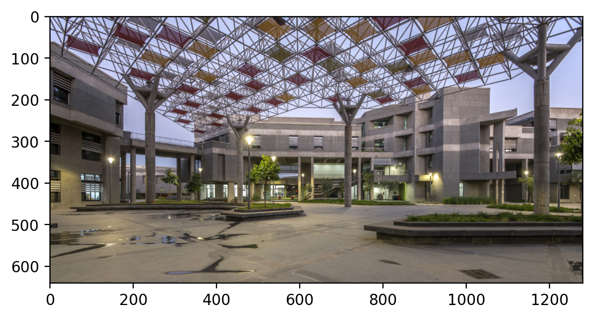
    

Cropped Image: 

    
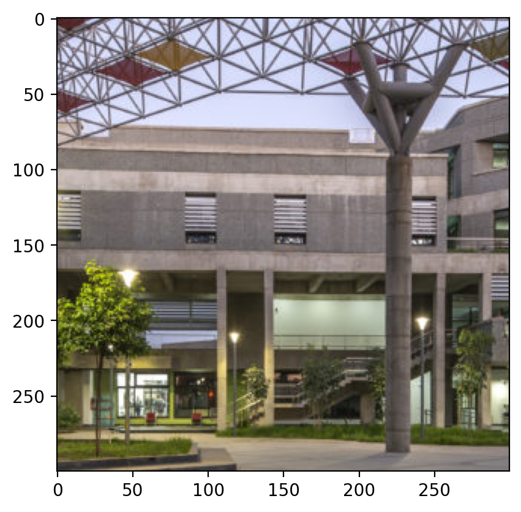
    

Masked Images: 

    
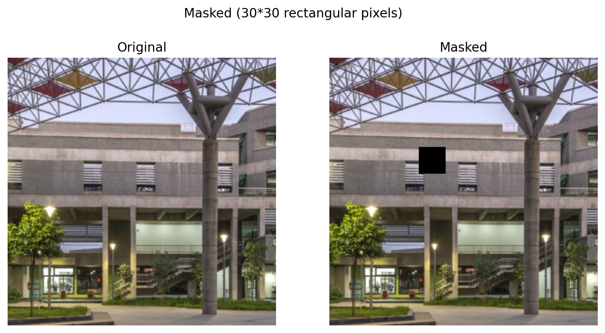
    

    
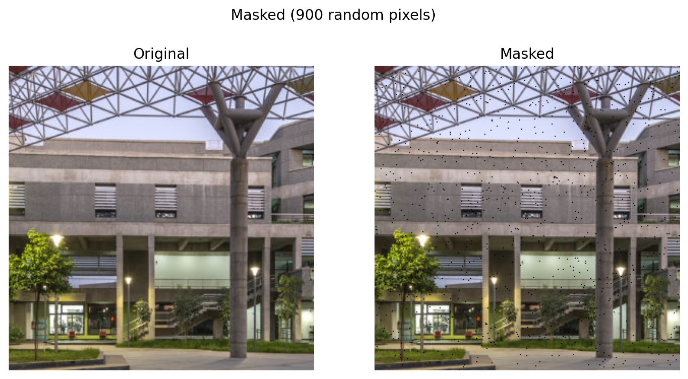
    

### Image Reconstruction with Varying Ranks using Gradient Descent on Rectangular Patch:
   

    --------------------------------------------------
    Evaluating rank: 5
    --------------------------------------------------
    Iteration 1000, loss: 68.04456329345703
    Iteration 2000, loss: 62.640281677246094
    Converged at iteration 2566, loss: 62.42113494873047
    RMSE: 0.010956, PSNR: 39.206600
    

    

    

    
    
    
    --------------------------------------------------
    Evaluating rank: 10
    --------------------------------------------------
    Iteration 1000, loss: 58.87605667114258
    Iteration 2000, loss: 51.959068298339844
    Converged at iteration 2584, loss: 50.307029724121094
    RMSE: 0.009792, PSNR: 40.182362
    

    

    

    
    
    
    --------------------------------------------------
    Evaluating rank: 20
    --------------------------------------------------
    Iteration 1000, loss: 48.273170471191406
    Iteration 2000, loss: 40.76818084716797
    Iteration 3000, loss: 37.96436309814453
    Converged at iteration 3156, loss: 37.74274444580078
    RMSE: 0.009925, PSNR: 40.065697
    

    
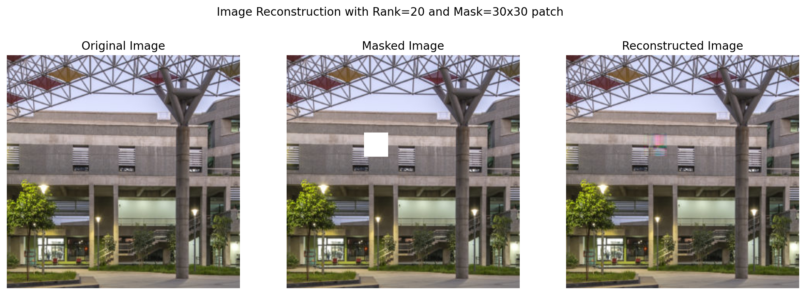
    

    
    
    
    --------------------------------------------------
    Evaluating rank: 50
    --------------------------------------------------
    Iteration 1000, loss: 34.4340705871582
    Converged at iteration 1838, loss: 28.38167953491211
    RMSE: 0.008891, PSNR: 41.020580
    

    

    

    
    
    
    --------------------------------------------------
    Evaluating rank: 100
    --------------------------------------------------
    Iteration 1000, loss: 24.65315818786621
    Converged at iteration 1157, loss: 23.548919677734375
    RMSE: 0.010085, PSNR: 39.926533
    

    

    

    
    
    
    --------------------------------------------------
    Evaluating rank: 150
    --------------------------------------------------
    Iteration 1000, loss: 20.20585060119629
    Iteration 2000, loss: 16.05418586730957
    Converged at iteration 2351, loss: 15.17437744140625
    RMSE: 0.011138, PSNR: 39.063828
    

    

    

    
    
    
    --------------------------------------------------
    Evaluating rank: 200
    --------------------------------------------------
    Iteration 1000, loss: 17.08736801147461
    Converged at iteration 1531, loss: 14.968915939331055
    RMSE: 0.016415, PSNR: 35.695045
    

    

    

    
    
    
    --------------------------------------------------
    Evaluating rank: 400
    --------------------------------------------------
    Iteration 1000, loss: 12.795358657836914
    Iteration 2000, loss: 11.368173599243164
    Iteration 3000, loss: 10.707222938537598
    Iteration 4000, loss: 10.288851737976074
    Converged at iteration 4459, loss: 10.14673137664795
    RMSE: 0.050858, PSNR: 25.872862
    

    

    

 ### Image Reconstruction with Varying Rank: 
    
    
    

    
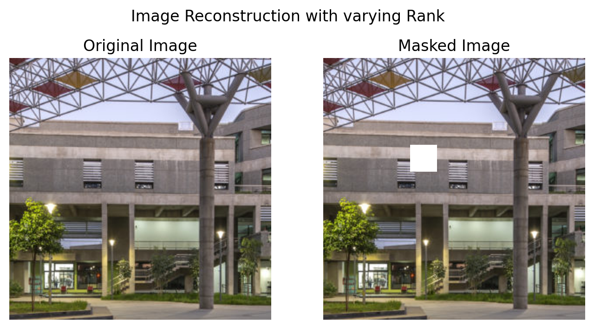
    

    
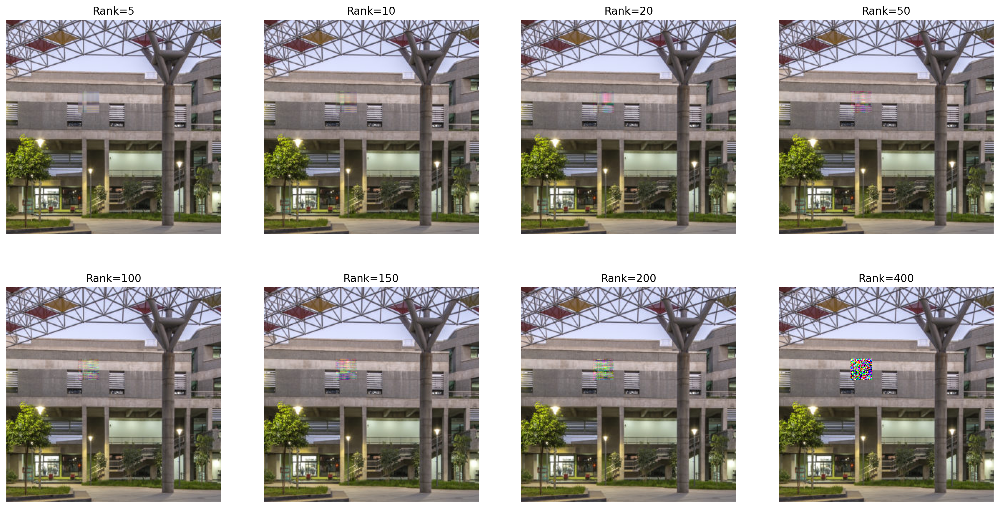
    

PLots: 

    Rank: 5, Loss: 62.4211, RMSE: 0.0110, PSNR: 39.2066
    Rank: 10, Loss: 50.3070, RMSE: 0.0098, PSNR: 40.1824
    Rank: 20, Loss: 37.7427, RMSE: 0.0099, PSNR: 40.0657
    Rank: 50, Loss: 28.3817, RMSE: 0.0089, PSNR: 41.0206
    Rank: 100, Loss: 23.5489, RMSE: 0.0101, PSNR: 39.9265
    Rank: 150, Loss: 15.1744, RMSE: 0.0111, PSNR: 39.0638
    Rank: 200, Loss: 14.9689, RMSE: 0.0164, PSNR: 35.6950
    Rank: 400, Loss: 10.1467, RMSE: 0.0509, PSNR: 25.8729
    

    
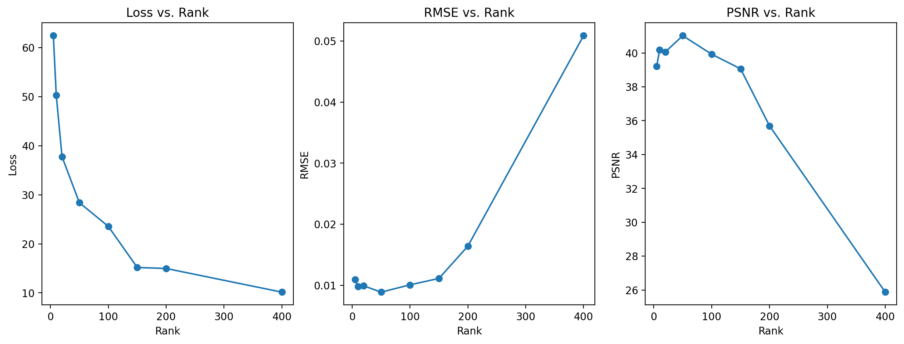
    

### Optimal Rank and Matrix:

    Optimal Rank and Metrics:
    
    Rank: 50
    PSNR: 41.0206
    RMSE: 0.0089

    

Image Reconstruction with Varying Rank using Gradient Descent on Random 900 Pixels:

    --------------------------------------------------
    Evaluating rank: 5
    --------------------------------------------------
    Iteration 1000, loss: 68.29059600830078
    Iteration 2000, loss: 62.51821517944336
    Converged at iteration 2273, loss: 62.42795944213867
    RMSE: 0.011399, PSNR: 38.862843
    

    

    

    
    
    
    --------------------------------------------------
    Evaluating rank: 10
    --------------------------------------------------
    Iteration 1000, loss: 59.44832229614258
    Iteration 2000, loss: 52.32437515258789
    Iteration 3000, loss: 50.00370788574219
    Converged at iteration 3913, loss: 49.73929977416992
    RMSE: 0.009044, PSNR: 40.873108
    

    

    

    
    
    
    --------------------------------------------------
    Evaluating rank: 20
    --------------------------------------------------
    Iteration 1000, loss: 48.95173263549805
    Iteration 2000, loss: 41.183876037597656
    Iteration 3000, loss: 38.252986907958984
    Converged at iteration 3381, loss: 37.758262634277344
    RMSE: 0.006735, PSNR: 43.433395
    

    

    

    
    
    
    --------------------------------------------------
    Evaluating rank: 50
    --------------------------------------------------
    Iteration 1000, loss: 34.59613037109375
    Iteration 2000, loss: 27.566774368286133
    Iteration 3000, loss: 24.390289306640625
    Iteration 4000, loss: 22.549152374267578
    Iteration 5000, loss: 21.462804794311523
    Converged at iteration 5108, loss: 21.338109970092773
    RMSE: 0.003964, PSNR: 48.037132
    

    
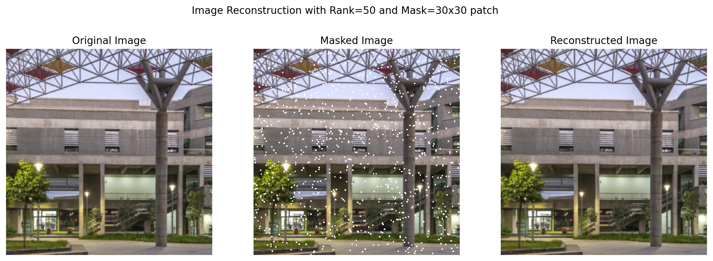
    

    
    
    
    --------------------------------------------------
    Evaluating rank: 100
    --------------------------------------------------
    Iteration 1000, loss: 24.811725616455078
    Iteration 2000, loss: 19.58082389831543
    Iteration 3000, loss: 17.104040145874023
    Iteration 4000, loss: 15.5360746383667
    Iteration 5000, loss: 14.4513521194458
    Iteration 6000, loss: 13.596306800842285
    Iteration 7000, loss: 12.932978630065918
    Iteration 8000, loss: 12.394889831542969
    Iteration 9000, loss: 11.932838439941406
    Iteration 10000, loss: 11.518310546875
    RMSE: 0.002409, PSNR: 52.362099
    

    

    

    
    
    
    --------------------------------------------------
    Evaluating rank: 150
    --------------------------------------------------
    Iteration 1000, loss: 19.934751510620117
    Iteration 2000, loss: 15.88932991027832
    Iteration 3000, loss: 13.882695198059082
    Iteration 4000, loss: 12.613967895507812
    Converged at iteration 4340, loss: 12.273750305175781
    RMSE: 0.002741, PSNR: 51.241535
    

    

    

    
    
    
    --------------------------------------------------
    Evaluating rank: 200
    --------------------------------------------------
    Iteration 1000, loss: 17.191930770874023
    Iteration 2000, loss: 13.851380348205566
    Iteration 3000, loss: 12.160633087158203
    Converged at iteration 3459, loss: 11.637883186340332
    RMSE: 0.002800, PSNR: 51.055878
    

    

    

    
    
    
    --------------------------------------------------
    Evaluating rank: 400
    --------------------------------------------------
    Iteration 1000, loss: 12.710806846618652
    Iteration 2000, loss: 11.346916198730469
    Iteration 3000, loss: 10.690279006958008
    Converged at iteration 3846, loss: 10.339591026306152
    RMSE: 0.006225, PSNR: 44.117332
    

    

    

    
    
    
    
Image Reconstruction with Varying Rank using Gradient Descent on Missing 900 Pixels:

    
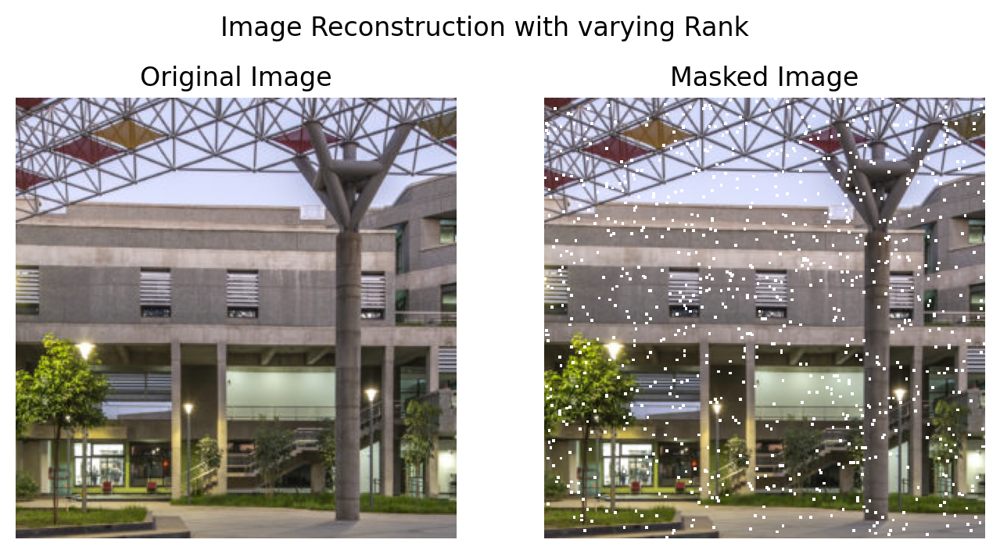
    

    

    

Plots:

    Rank: 5, Loss: 62.4280, RMSE: 0.0114, PSNR: 38.8628
    Rank: 10, Loss: 49.7393, RMSE: 0.0090, PSNR: 40.8731
    Rank: 20, Loss: 37.7583, RMSE: 0.0067, PSNR: 43.4334
    Rank: 50, Loss: 21.3381, RMSE: 0.0040, PSNR: 48.0371
    Rank: 100, Loss: 11.5183, RMSE: 0.0024, PSNR: 52.3621
    Rank: 150, Loss: 12.2738, RMSE: 0.0027, PSNR: 51.2415
    Rank: 200, Loss: 11.6379, RMSE: 0.0028, PSNR: 51.0559
    Rank: 400, Loss: 10.3396, RMSE: 0.0062, PSNR: 44.1173
    

    
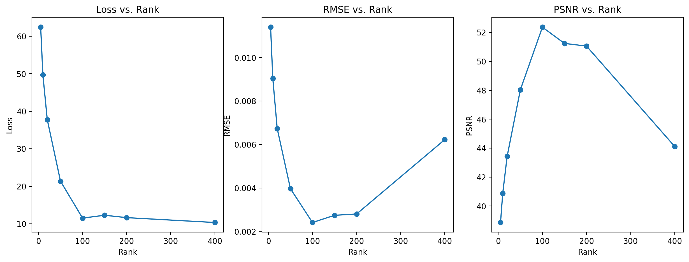
    

Optimal Value of Rank:

    Optimal Rank and Metrics:
    
    Rank: 100
    PSNR: 52.3621
    RMSE: 0.0024
    
Image Reconstruction with Varying Rank using Alternating Least Squares on Rectangular Patch:

    --------------------------------------------------
    Evaluating rank: 5
    --------------------------------------------------
    Channel 0 converged at step 7, RMSE=0.116243
    Channel 1, Step 10, RMSE=0.119212
    Channel 1 converged at step 13, RMSE=0.119171
    Channel 2 converged at step 8, RMSE=0.126419
    RMSE: 0.010949, PSNR: 39.212738
    

    

    

    
    
    
    --------------------------------------------------
    Evaluating rank: 10
    --------------------------------------------------
    Channel 0, Step 10, RMSE=0.093298
    Channel 0 converged at step 15, RMSE=0.093182
    Channel 1, Step 10, RMSE=0.095486
    Channel 1 converged at step 13, RMSE=0.095452
    Channel 2, Step 10, RMSE=0.099707
    Channel 2, Step 20, RMSE=0.099486
    Channel 2 converged at step 22, RMSE=0.099466
    RMSE: 0.010324, PSNR: 39.723431
    

    

    

    
    
    
    --------------------------------------------------
    Evaluating rank: 20
    --------------------------------------------------
    Channel 0, Step 10, RMSE=0.070525
    Channel 0 converged at step 17, RMSE=0.070373
    Channel 1, Step 10, RMSE=0.071654
    Channel 1, Step 20, RMSE=0.071485
    Channel 1 converged at step 20, RMSE=0.071485
    Channel 2, Step 10, RMSE=0.072590
    Channel 2 converged at step 15, RMSE=0.072483
    RMSE: 0.009095, PSNR: 40.823788
    

    

    

    
    
    
    --------------------------------------------------
    Evaluating rank: 50
    --------------------------------------------------
    Channel 0, Step 10, RMSE=0.037988
    Channel 0 converged at step 12, RMSE=0.037965
    Channel 1, Step 10, RMSE=0.038030
    Channel 1 converged at step 15, RMSE=0.037952
    Channel 2, Step 10, RMSE=0.036770
    Channel 2 converged at step 12, RMSE=0.036746
    RMSE: 0.008018, PSNR: 41.918365
    

    

    

    
    
    
    --------------------------------------------------
    Evaluating rank: 100
    --------------------------------------------------
    Channel 0, Step 10, RMSE=0.015746
    Channel 0 converged at step 11, RMSE=0.015739
    Channel 1, Step 10, RMSE=0.015711
    Channel 1 converged at step 11, RMSE=0.015701
    Channel 2, Step 10, RMSE=0.015377
    Channel 2 converged at step 11, RMSE=0.015368
    RMSE: 0.011228, PSNR: 38.993744
    

    

    

    
    
    
    --------------------------------------------------
    Evaluating rank: 150
    --------------------------------------------------
    Channel 0, Step 10, RMSE=0.006738
    Channel 0 converged at step 11, RMSE=0.006730
    Channel 1, Step 10, RMSE=0.006690
    Channel 1 converged at step 10, RMSE=0.006690
    Channel 2, Step 10, RMSE=0.006732
    Channel 2 converged at step 10, RMSE=0.006732
    RMSE: 0.020525, PSNR: 33.754536
    

    

    

    
    
    
    --------------------------------------------------
    Evaluating rank: 200
    --------------------------------------------------
    Channel 0, Step 10, RMSE=0.002413
    Channel 0 converged at step 10, RMSE=0.002413
    Channel 1, Step 10, RMSE=0.002390
    Channel 1 converged at step 10, RMSE=0.002390
    Channel 2, Step 10, RMSE=0.002440
    Channel 2 converged at step 11, RMSE=0.002431
    RMSE: 0.028869, PSNR: 30.791416
    

    

    

    
    
    
    --------------------------------------------------
    Evaluating rank: 400
    --------------------------------------------------
    Channel 0 converged at step 4, RMSE=0.000003
    Channel 1 converged at step 2, RMSE=0.000072
    Channel 2 converged at step 8, RMSE=0.000003
    RMSE: 0.019744, PSNR: 34.091251
    

    

    

    
    
    
    

Image Reconstruction with Varying Rank using Alternating Least Squares on Rectangular Patch:

    

    

    

    

Plots:

    Rank: 5, Loss: 0.0725, RMSE: 0.0096, PSNR: 40.3754
    Rank: 10, Loss: 0.0725, RMSE: 0.0088, PSNR: 41.1574
    Rank: 20, Loss: 0.0725, RMSE: 0.0092, PSNR: 40.7630
    Rank: 50, Loss: 0.0725, RMSE: 0.0093, PSNR: 40.6016
    Rank: 100, Loss: 0.0725, RMSE: 0.0099, PSNR: 40.0709
    Rank: 150, Loss: 0.0725, RMSE: 0.0101, PSNR: 39.9340
    Rank: 200, Loss: 0.0725, RMSE: 0.0091, PSNR: 40.8613
    Rank: 400, Loss: 0.0725, RMSE: 0.0090, PSNR: 40.9013
    

    
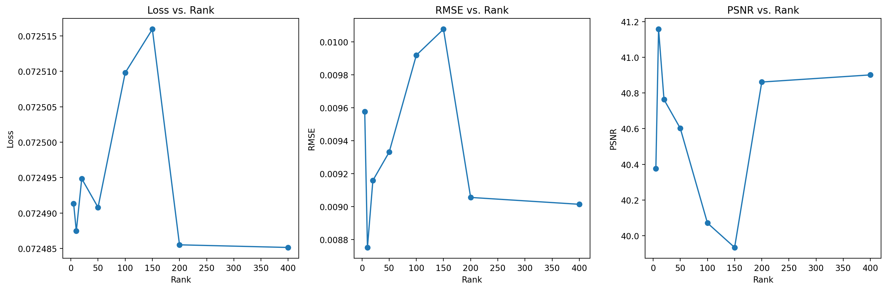
    

Optimal Value of Rank:

    Optimal Rank and Metrics:
    
    Rank: 10
    PSNR: 41.1574
    RMSE: 0.0088
    

Image Reconstruction with Varying Rank using Alternating Least Squares on 900 Missing Pixels:

    --------------------------------------------------
    Evaluating rank: 5
    --------------------------------------------------
    Channel 0, Step 10, RMSE=0.116141
    Channel 0 converged at step 12, RMSE=0.116119
    Channel 1 converged at step 7, RMSE=0.118972
    Channel 2, Step 10, RMSE=0.126536
    Channel 2 converged at step 15, RMSE=0.126223
    RMSE: 0.011804, PSNR: 38.559517
    

    

    

    
    
    
    --------------------------------------------------
    Evaluating rank: 10
    --------------------------------------------------
    Channel 0, Step 10, RMSE=0.093546
    Channel 0, Step 20, RMSE=0.093179
    Channel 0 converged at step 28, RMSE=0.093086
    Channel 1, Step 10, RMSE=0.095442
    Channel 1, Step 20, RMSE=0.095207
    Channel 1, Step 30, RMSE=0.094984
    Channel 1 converged at step 33, RMSE=0.094952
    Channel 2, Step 10, RMSE=0.099549
    Channel 2 converged at step 15, RMSE=0.099489
    RMSE: 0.009752, PSNR: 40.218437
    

    

    

    
    
    
    --------------------------------------------------
    Evaluating rank: 20
    --------------------------------------------------
    Channel 0, Step 10, RMSE=0.070216
    Channel 0 converged at step 11, RMSE=0.070207
    Channel 1, Step 10, RMSE=0.071465
    Channel 1 converged at step 15, RMSE=0.071381
    Channel 2, Step 10, RMSE=0.072385
    Channel 2 converged at step 14, RMSE=0.072326
    RMSE: 0.007756, PSNR: 42.207382
    

    
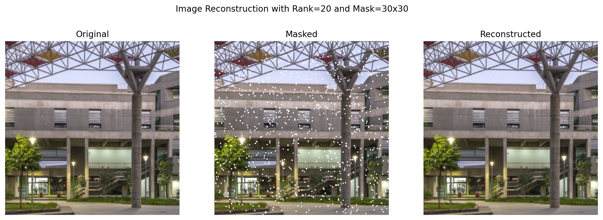
    

    
    
    
    --------------------------------------------------
    Evaluating rank: 50
    --------------------------------------------------
    Channel 0, Step 10, RMSE=0.037857
    Channel 0 converged at step 14, RMSE=0.037808
    Channel 1, Step 10, RMSE=0.037825
    Channel 1 converged at step 12, RMSE=0.037808
    Channel 2, Step 10, RMSE=0.036696
    Channel 2 converged at step 15, RMSE=0.036617
    RMSE: 0.006394, PSNR: 43.884575
    

    

    

    
    
    
    --------------------------------------------------
    Evaluating rank: 100
    --------------------------------------------------
    Channel 0, Step 10, RMSE=0.015622
    Channel 0 converged at step 11, RMSE=0.015615
    Channel 1, Step 10, RMSE=0.015620
    Channel 1 converged at step 11, RMSE=0.015611
    Channel 2, Step 10, RMSE=0.015264
    Channel 2 converged at step 10, RMSE=0.015264
    RMSE: 0.006438, PSNR: 43.825230
    

    

    

    
    
    
    --------------------------------------------------
    Evaluating rank: 150
    --------------------------------------------------
    Channel 0, Step 10, RMSE=0.006683
    Channel 0 converged at step 11, RMSE=0.006673
    Channel 1, Step 10, RMSE=0.006686
    Channel 1 converged at step 13, RMSE=0.006650
    Channel 2, Step 10, RMSE=0.006709
    Channel 2 converged at step 12, RMSE=0.006688
    RMSE: 0.008364, PSNR: 41.551956
    

    

    

    
    
    
    --------------------------------------------------
    Evaluating rank: 200
    --------------------------------------------------
    Channel 0, Step 10, RMSE=0.002463
    Channel 0 converged at step 17, RMSE=0.002353
    Channel 1, Step 10, RMSE=0.002401
    Channel 1 converged at step 15, RMSE=0.002336
    Channel 2, Step 10, RMSE=0.002511
    Channel 2 converged at step 17, RMSE=0.002401
    RMSE: 0.014817, PSNR: 36.584980
    

    

    

    
    
    
    --------------------------------------------------
    Evaluating rank: 400
    --------------------------------------------------
    Channel 0 converged at step 3, RMSE=0.000089
    Channel 1, Step 10, RMSE=0.000114
    Channel 1 converged at step 12, RMSE=0.000063
    Channel 2 converged at step 6, RMSE=0.000102
    RMSE: 0.029158, PSNR: 30.704971
    

    

    

    
    
    
Image Reconstruction with Varying Rank using Alternating Least Squares on 900 Random Pixels:

    

    

    
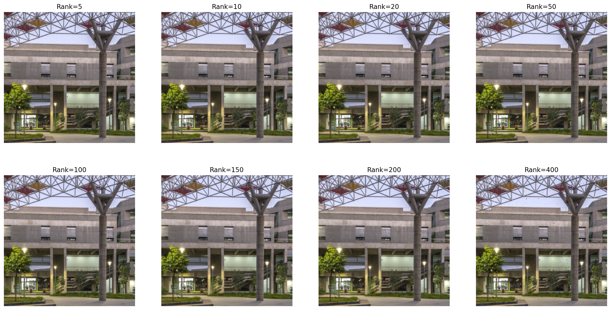
    

Plots:

    Rank: 5, Loss: 0.1262, RMSE: 0.0118, PSNR: 38.5595
    Rank: 10, Loss: 0.0995, RMSE: 0.0098, PSNR: 40.2184
    Rank: 20, Loss: 0.0723, RMSE: 0.0078, PSNR: 42.2074
    Rank: 50, Loss: 0.0366, RMSE: 0.0064, PSNR: 43.8846
    Rank: 100, Loss: 0.0153, RMSE: 0.0064, PSNR: 43.8252
    Rank: 150, Loss: 0.0067, RMSE: 0.0084, PSNR: 41.5520
    Rank: 200, Loss: 0.0024, RMSE: 0.0148, PSNR: 36.5850
    Rank: 400, Loss: 0.0001, RMSE: 0.0292, PSNR: 30.7050
    

    
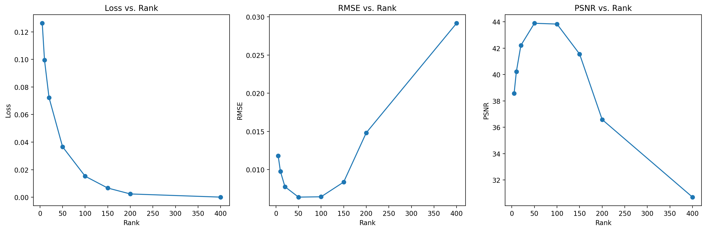
    

Optimal Value of Rank:

    Optimal Rank and Metrics:
    
    Rank: 50
    PSNR: 43.8846
    RMSE: 0.0064

# Observations

## Reconstruction using Gradient Descent (GD)  

The GD-based MF approach iteratively updates factor matrices **W** and **H** to minimize the reconstruction loss over known pixel values.

### Results  
Reconstruction was performed for different **ranks**.

- **Rectangular mask:**  
  - RMSE gradually decreased with higher rank.  
  - PSNR increased slightly, showing better reconstruction at higher rank.  
  - Very high rank (r = 50) caused minor noise or overfitting to known pixels.

- **Random pixel mask:**  
  - Performed better than rectangular masking due to evenly distributed known pixels.  
  - Reconstructed images preserved finer details.

### Observation  
- GD achieved stable convergence but required careful learning rate tuning.  
- Reconstruction quality improved with rank up to an optimal point.

---

## Reconstruction using Alternating Least Squares (ALS)  

ALS alternately optimises one factor matrix while keeping the other fixed, solving least-squares subproblems at each step.

### Results  
ALS was tested using the same masks and ranks.

- **Rectangular patch:**  
  - RMSE values were slightly lower than GD.  
  - PSNR was consistently higher, indicating cleaner reconstruction.  

- **Random mask:**  
  - Produced sharper reconstructions and preserved edges better.  
  - Converged faster and was more stable than GD.

### Observation  
- ALS handled missing pixel patterns efficiently.  
- Increasing rank improved image quality until it reached a saturation point.

---

## Rank = 20 Performance Summary

| Method | Mask Type | RMSE | PSNR (dB) | Remarks |
|---------|------------|--------|-----------|--------------------------------------------|
| **GD (Gradient Descent)** | Rectangular Patch | 0.009925 | 40.07 | Moderate reconstruction; slight overfitting avoided |
| **GD (Gradient Descent)** | Random 900 Pixels | 0.006735 | 43.43 | Best GD performance; fine details well restored |
| **ALS (Alternating Least Squares)** | Rectangular Patch | 0.009095 | 40.82 | Slightly better than GD in clarity and stability |
| **ALS (Alternating Least Squares)** | Random 900 Pixels | 0.007756 | 42.21 | Sharpest reconstruction; highest stability and PSNR |

---

## Best performance:

| Case | Method | Best Rank | RMSE ↓ | PSNR ↑ |
|------|---------|------------|---------|---------|
| Rectangular Patch | GD | 50 | 0.0089 | 41.02 |
| Rectangular Patch | ALS | 10 | 0.0088 | 41.16 |
| Random 900 Pixels | GD | 100 | 0.0024 | 52.36 |
| Random 900 Pixels | ALS | 50 | 0.0064 | 43.88 |

