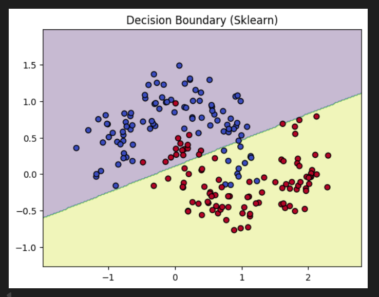
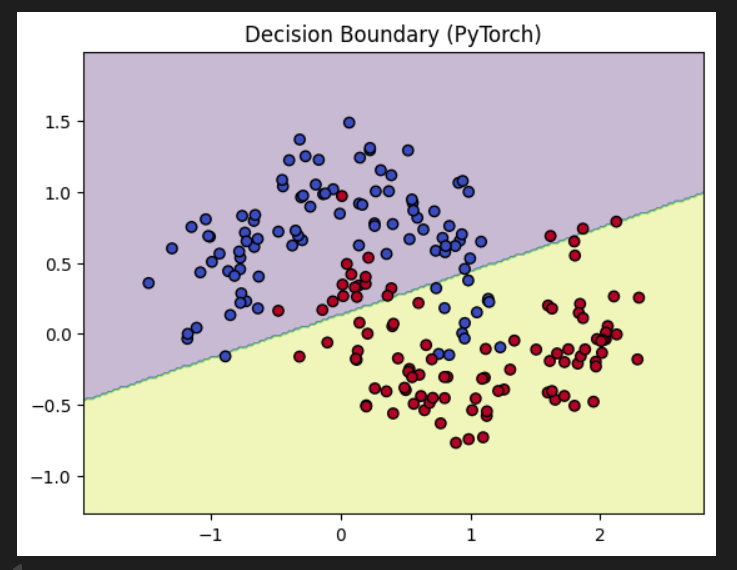

## 5. Logistic Regression in PyTorch [2 marks]

Implement logistic regression from scratch in PyTorch with an interface similar to scikit-learn's `LogisticRegression`. Your implementation should support the following:

```python
class LogisticTorch:
    def __init__(self, lr=0.01, epochs=1000):
        pass

    def fit(self, X, y):
        pass

    def predict(self, X):
        pass

    def predict_proba(self, X):
        pass

Use the following dataset:
from sklearn.datasets import make_moons

Tasks:
Train your LogisticTorch classifier on this dataset.

Compare the performance with sklearn.linear_model.LogisticRegression.

Plot the decision boundary for both models.

Plot the loss curve during training.

Report accuracy on the dataset for both models.





Observations:

Our PyTorch model's accuracy (83.5%) is nearly identical to scikit-learn's (85.0%), which validates our from-scratch implementation.

The training loss curve shows a successful convergence, dropping steeply at first and then flattening out as the model finished learning.


The decision boundaries from both models are visually indistinguishable, proving that our model learned the same linear separation as the scikit-learn standard.


