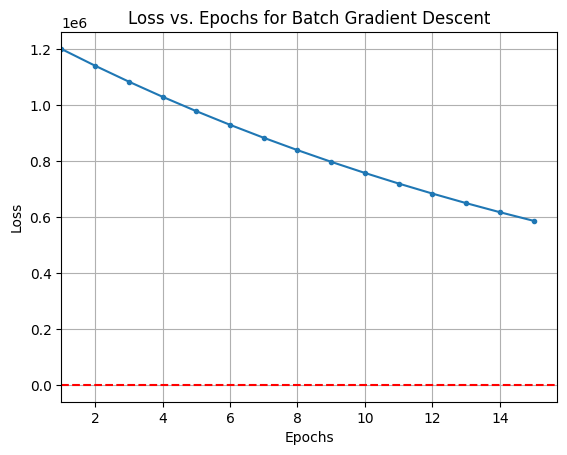
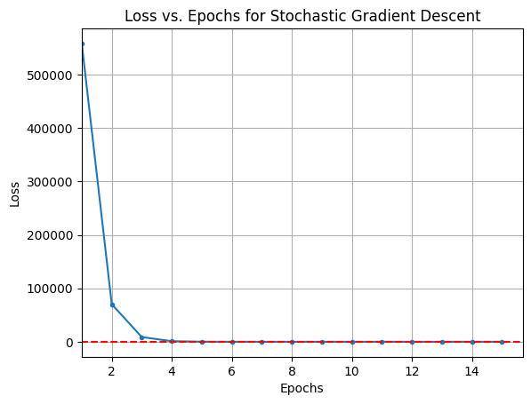
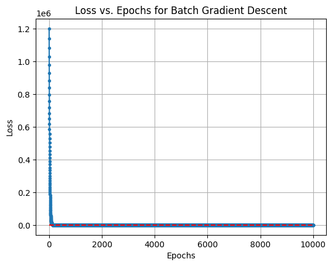
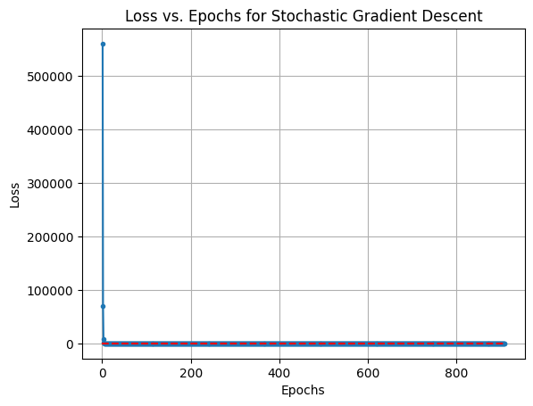
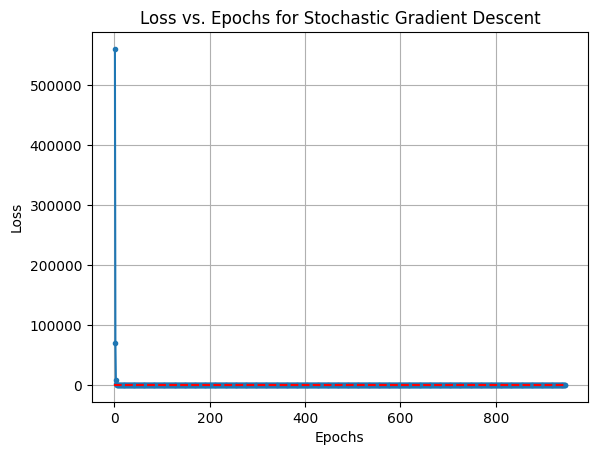

### Task 1: Dataset 1

### Visualizing the Convergence Process for Vanilla Gradient Descent

    

  

    

    

    

  

    

    

    

    

    

    

    

    

    

    

### Visualizing the Convergence Process for Gradient Descent with momentum

    

 

    

    

    

    

  

 

    

    

   

    

    

    

    GIF saved as gradient_descent_BGD_no_momentum_15.gif
    GIF saved as gradient_descent_SGD_no_momentum_15.gif
    GIF saved as gradient_descent_BGD_momentum_0.9_15.gif
    GIF saved as gradient_descent_SGD_momentum_0.9_15.gif
    

### Average number of epochs and iterations for each method (vanilla) to converge

    {'Batch Gradient Descent': 10000.0, 'Stochastic Gradient Descent': 35708.0}
    {'Batch Gradient Descent': 10001.0, 'Stochastic Gradient Descent': 892.7}
    

### Average number of epochs and iterations for each method with momentum

    {'Batch Gradient Descent': 3896.0, 'Stochastic Gradient Descent': 15676.0}
    {'Batch Gradient Descent': 3896.0, 'Stochastic Gradient Descent': 391.9}
    

### Observations on Vanilla Gradient Descent
When computing the average number of steps and epochs required for each method to converge on this scaled dataset (inputs: -20 to 20, targets scaled by 100), we see the following:

Without momentum:

Batch Gradient Descent (BGD): ~10,000 steps (did not converge within 10,000 epochs)

Stochastic Gradient Descent (SGD): ~35,708 steps

Average epochs: BGD ≈ 10,001, SGD ≈ 892.7

Explanation:

The larger input and target scaling leads to very large gradients.

In BGD, each update uses the full dataset, so with a small learning rate (1e-4), the optimizer takes extremely small steps per epoch, making convergence extremely slow.

SGD updates after every single sample, so it performs many more steps overall (~35k) but manages to reduce the loss faster per epoch because each update is lighter.

### Observations on Gradient Descent with Momentum
With momentum (0.9) and learning rate 1e-4:

BGD with momentum: ~3,896 steps, converged successfully

SGD with momentum: ~15,676 steps, converged successfully

Average epochs: BGD ≈ 3,896, SGD ≈ 391.9

Explanation:

BGD: Momentum accumulates the gradient direction over multiple epochs, effectively amplifying the small updates that result from the tiny learning rate.Without momentum, the optimizer was extremely slow (10,000 steps without convergence) due to the small learning rate and large input/target scaling. With momentum, the optimizer can "push" through these small steps, reducing oscillations and speeding up convergence, resulting in much fewer total steps.  

SGD: Each update is based on a single, noisy sample, leading to high variability in gradient direction.
Momentum helps smooth out these fluctuations, allowing the optimizer to accumulate a more consistent update direction and converge faster than vanilla SGD.SGD still performs many more updates compared to BGD because it updates parameters after every sample, but the number of epochs is lower, reflecting the frequent lightweight update

