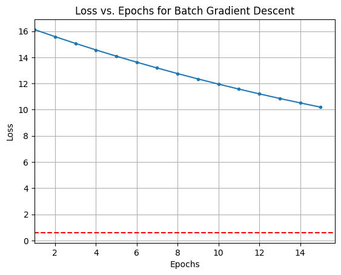
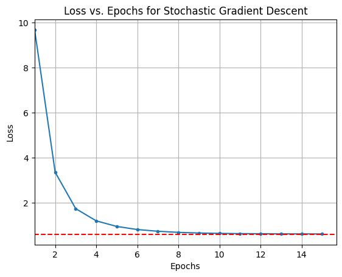
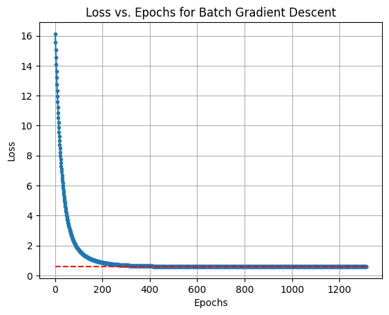
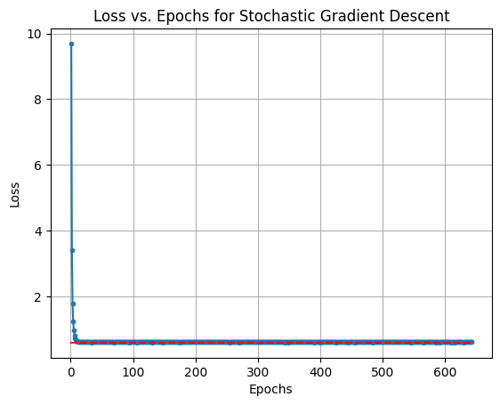
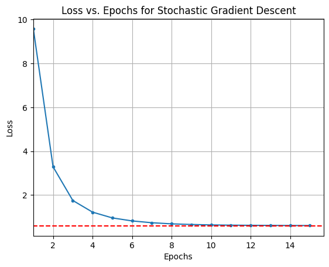
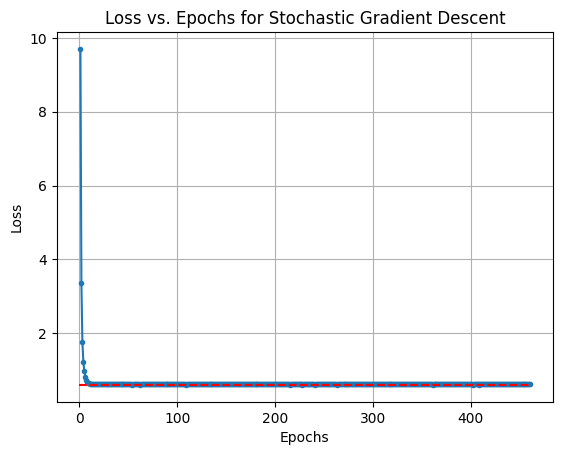

### Task 1: Dataset 2

### Visualizing the Convergence Process for Vanilla Gradient Descent

    

    

    

    

    

    

    

    

    

    

### Visualizing the Convergence Process for Gradient Descent with momentum

    

    

    

    

    

    

    

    

    GIF saved as gradient_descent_BGD_no_momentum_15.gif
    GIF saved as gradient_descent_SGD_no_momentum_15.gif
    GIF saved as gradient_descent_BGD_momentum_0.9_15.gif
    GIF saved as gradient_descent_SGD_momentum_0.9_15.gif
    

### Average number of epochs and iterations for each method (vanilla) to converge

    {'Batch Gradient Descent': 1314.0, 'Stochastic Gradient Descent': 7168.0}
    {'Batch Gradient Descent': 1314.0, 'Stochastic Gradient Descent': 179.2}
    

### Average number of epochs and iterations for each method with momentum

    {'Batch Gradient Descent': 149.0, 'Stochastic Gradient Descent': 40000.0}
    {'Batch Gradient Descent': 149.0, 'Stochastic Gradient Descent': 1001.0}
    

### Observations on Vanilla Gradient Descent

When computing the average number of steps required for each method to converge, it is observed that stochastic gradient descent (SGD) takes significantly more parameter update steps than full-batch gradient descent (BGD). Although SGD may complete fewer epochs before convergence, each epoch involves an update after every sample, resulting in a much higher total number of steps.

In the experiment:

Average steps (updates) for BGD ≈ 1314

Average steps (updates) for SGD ≈ 7168

Average epochs for BGD ≈ 1314

Average epochs for SGD ≈ 179.2

The higher step count in SGD arises because it performs one update per sample, whereas BGD performs a single update after processing the entire dataset. Consequently, SGD’s loss trajectory exhibits noticeable fluctuations due to the noise in individual gradient estimates, while BGD shows a smoother and more stable descent.

However, since each SGD update uses only one data point, it is computationally lighter per iteration and often achieves practical convergence faster despite its noisier path. In contrast, BGD’s updates are more computationally expensive per step but yield steadier convergence toward the minimum.

### Observations on Gradient Descent with Momentum
When momentum was introduced (momentum coefficient = 0.9, learning rate = 0.01):

BGD with momentum converged in approximately 149 steps, much faster than vanilla BGD (1314 steps).

SGD with momentum, however, required around 40,000 steps and failed to converge within the same threshold for most runs.

This opposite behavior occurs because:

In BGD, the momentum term helps accumulate gradient direction over full-batch updates, allowing the optimizer to move consistently toward the minimum while reducing oscillations. Since the gradients are computed over the entire dataset, the updates are stable, and momentum accelerates convergence efficiently — reducing the total steps drastically.

In SGD, each update is based on a single noisy sample. The momentum term, instead of smoothing, amplifies the noise because it accumulates random fluctuations in gradient direction. With the same relatively large learning rate (0.01), this causes overshooting and oscillations, preventing stable convergence and significantly increasing the total number of steps.

Thus, while momentum improves BGD, it destabilizes SGD under the same hyperparameters — highlighting that momentum requires careful tuning of the learning rate when used with stochastic updates.
