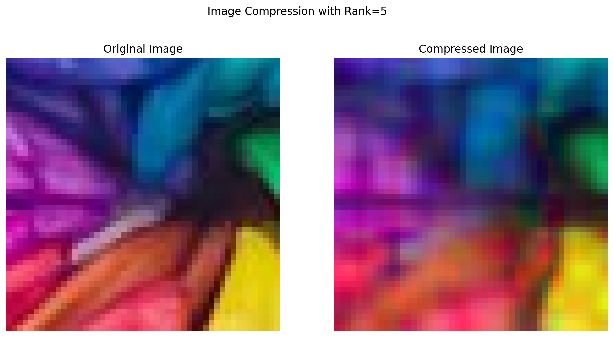
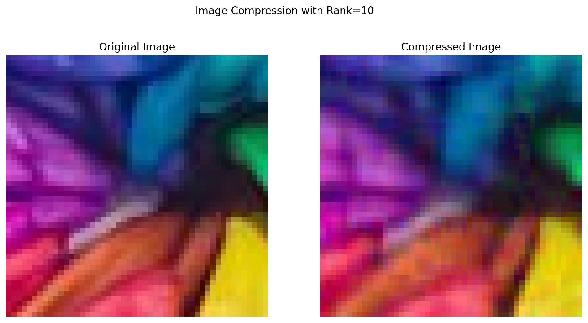
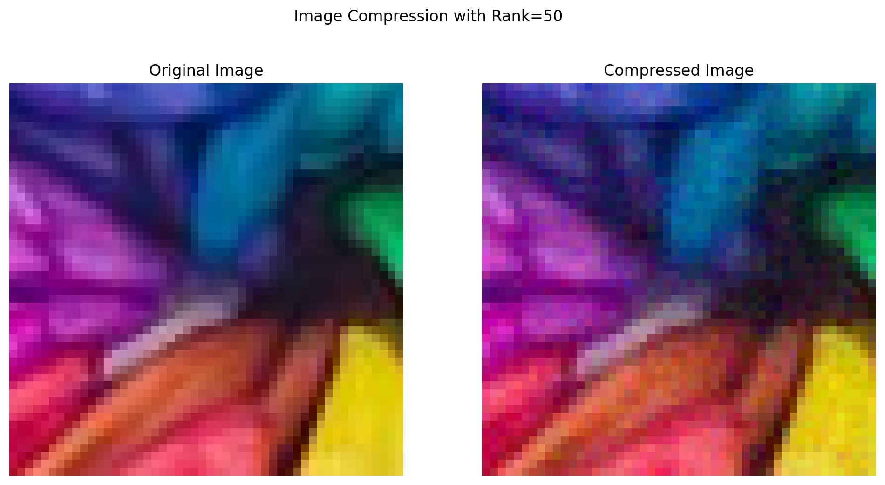
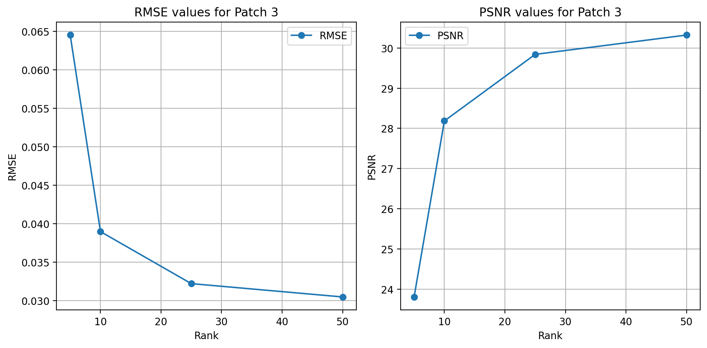

# Task-4B Data Compression using Matrix Factorization

Consider an image patch of size (50x50) that you want to compress using matrix factorization. To do this, you'll split the patch [N×N] into two smaller matrices of size [N×r] and [r×N] using matrix factorization. Compute the compressed patch by multiplying these two matrices and compare the reconstructed image patch with the original patch. 
Consider the following three cases-

- a patch with mainly a single color.
- a patch with 2-3 different colors.
- a patch with at least 5 different colors.

Test different values for the low-rank r=[5,10,25,50]. Use Gradient Descent to learn the compressed matrices. Display the reconstructed image patches, keeping the original pixel values outside the patch unchanged, and use your compressed matrix for the patch to show how well the reconstruction works.

  ### Original Image  

    

### Croppped image

    

    

## Patch Selection

    ____________________________________________________________________________________________________
    Patch 1 with single color:
    Shape of the patch: torch.Size([3, 50, 50])
    

    

    

    ____________________________________________________________________________________________________
    Patch 2 with 2 colors:
    Shape of the patch: torch.Size([3, 50, 50])
    

    

    

    ____________________________________________________________________________________________________
    Patch 3 with 5+ colors:
    Shape of the patch: torch.Size([3, 50, 50])
    

    

    

## Patch 1

    ____________________________________________________________________________________________________
    
    
    Rank: 5
    Channel 0 converged at step 538, loss=0.000615  
    Channel 1, Step 1000, Loss=0.000716
    Channel 1 converged at step 1143, loss=0.000541
    Channel 2 converged at step 383, loss=0.000890
    RMSE: 0.026093, PSNR: 31.669529
    

    

    

    

    

    ____________________________________________________________________________________________________
    
    
    Rank: 10
    Channel 0 converged at step 967, loss=0.000758
    Channel 1, Step 1000, Loss=0.001186
    Channel 1 converged at step 1397, loss=0.000662
    Channel 2 converged at step 722, loss=0.000868
    RMSE: 0.027598, PSNR: 31.182388
    

    

    

    

    

    

    ____________________________________________________________________________________________________
    
    
    Rank: 25
    Channel 0, Step 1000, Loss=0.001964
    Channel 0 converged at step 1465, loss=0.000813
    Channel 1, Step 1000, Loss=0.002316
    Channel 1 converged at step 1605, loss=0.000721
    Channel 2, Step 1000, Loss=0.001544
    Channel 2 converged at step 1377, loss=0.000728
    RMSE: 0.027443, PSNR: 31.231449
    

    

    

    

    

    

    ____________________________________________________________________________________________________
    
    
    Rank: 50
    Channel 0, Step 1000, Loss=0.006656
    Channel 0, Step 2000, Loss=0.000628
    Channel 0 converged at step 2007, loss=0.000621
    Channel 1, Step 1000, Loss=0.008263
    Channel 1, Step 2000, Loss=0.000919
    Channel 1 converged at step 2207, loss=0.000664
    Channel 2, Step 1000, Loss=0.007431
    Channel 2, Step 2000, Loss=0.000763
    Channel 2 converged at step 2106, loss=0.000644
    RMSE: 0.025333, PSNR: 31.926271
    

    

    

    

    

    

Compressed Image with Varying Ranks:
    

    

    

    
## Plots:

    

    

## Patch-2

    ____________________________________________________________________________________________________
    
    
    Rank: 5
    Channel 0, Step 1000, Loss=0.001506
    Channel 0 converged at step 1148, loss=0.001305
    Channel 1 converged at step 934, loss=0.001807
    Channel 2 converged at step 575, loss=0.000945
    RMSE: 0.036759, PSNR: 28.692768
    

    

    

    

    

    

    ____________________________________________________________________________________________________
    
    
    Rank: 10
    Channel 0, Step 1000, Loss=0.001783
    Channel 0 converged at step 1517, loss=0.001053
    Channel 1, Step 1000, Loss=0.002498
    Channel 1 converged at step 1602, loss=0.001063
    Channel 2 converged at step 985, loss=0.000977
    RMSE: 0.032091, PSNR: 29.872330
    

    

    

    

    

    

    ____________________________________________________________________________________________________
    
    
    Rank: 25
    Channel 0, Step 1000, Loss=0.004066
    Channel 0 converged at step 1860, loss=0.000956
    Channel 1, Step 1000, Loss=0.004598
    Channel 1, Step 2000, Loss=0.000916
    Channel 1 converged at step 2022, loss=0.000894
    Channel 2, Step 1000, Loss=0.002515
    Channel 2 converged at step 1582, loss=0.000782
    RMSE: 0.029598, PSNR: 30.574768
    

    

    

    

    

    

    ____________________________________________________________________________________________________
    
    
    Rank: 50
    Channel 0, Step 1000, Loss=0.009900
    Channel 0, Step 2000, Loss=0.001348
    Channel 0 converged at step 2374, loss=0.000798
    Channel 1, Step 1000, Loss=0.009104
    Channel 1, Step 2000, Loss=0.001373
    Channel 1 converged at step 2404, loss=0.000801
    Channel 2, Step 1000, Loss=0.008447
    Channel 2, Step 2000, Loss=0.000841
    Channel 2 converged at step 2159, loss=0.000650
    RMSE: 0.027360, PSNR: 31.257809
    

    

    

    

    

    

### Image Compression with Varying Ranks:

    

    

    

    

## Plots:

    

    

## Patch-3

    ____________________________________________________________________________________________________
    
    
    Rank: 5
    Channel 0, Step 1000, Loss=0.003771
    Channel 0 converged at step 1012, loss=0.003759
    Channel 1, Step 1000, Loss=0.005688
    Channel 1 converged at step 1195, loss=0.005292
    Channel 2, Step 1000, Loss=0.003455
    Channel 2 converged at step 1012, loss=0.003443
    RMSE: 0.064527, PSNR: 23.805189
    

    

    

    

    

    

    ____________________________________________________________________________________________________
    
    
    Rank: 10
    Channel 0, Step 1000, Loss=0.003362
    Channel 0 converged at step 1673, loss=0.001388
    Channel 1, Step 1000, Loss=0.004855
    Channel 1 converged at step 1896, loss=0.001753
    Channel 2, Step 1000, Loss=0.003321
    Channel 2 converged at step 1661, loss=0.001417
    RMSE: 0.038967, PSNR: 28.186138
    

    

    

    

    

    

    ____________________________________________________________________________________________________
    
    
    Rank: 25
    Channel 0, Step 1000, Loss=0.005227
    Channel 0, Step 2000, Loss=0.001549
    Channel 0 converged at step 2430, loss=0.001001
    Channel 1, Step 1000, Loss=0.007270
    Channel 1, Step 2000, Loss=0.001502
    Channel 1 converged at step 2342, loss=0.001011
    Channel 2, Step 1000, Loss=0.006039
    Channel 2, Step 2000, Loss=0.001517
    Channel 2 converged at step 2341, loss=0.001101
    RMSE: 0.032201, PSNR: 29.842598
    

    

    

    

    

    

    ____________________________________________________________________________________________________
    
    
    Rank: 50
    Channel 0, Step 1000, Loss=0.009550
    Channel 0, Step 2000, Loss=0.001513
    Channel 0 converged at step 2411, loss=0.000945
    Channel 1, Step 1000, Loss=0.010726
    Channel 1, Step 2000, Loss=0.001750
    Channel 1 converged at step 2558, loss=0.000893
    Channel 2, Step 1000, Loss=0.010919
    Channel 2, Step 2000, Loss=0.001645
    Channel 2 converged at step 2464, loss=0.000950
    RMSE: 0.030468, PSNR: 30.323145
    

    

    

    

    

    

    

### Image Compression with Varying Ranks:

    

    

    

## Plots:

    

    

## Comparison Plots:

    

    

## Observations: Data Compression using Low-Rank Matrix Factorization

### 1. Single-Color Patch
- The patch contains only one dominant color, so pixel values are highly correlated.  
- Even with a **low rank (r = 5)**, the reconstructed image looks almost identical to the original patch.  
- Increasing rank beyond 10 does **not significantly improve** visual quality or RMSE/PSNR.  
- **Observation:** Low-rank factorization performs very well for uniform regions since the information content is minimal.

---

### 2. Patch with 2–3 Colors
- Here, pixel variations are more noticeable than in the single-color case.  
- For **r = 5**, there is visible **blurring or color mixing** at boundaries.  
- As the rank increases (**r = 10 → 25 → 50**), edges become sharper and colors are more distinct.  
- **Observation:** A moderate rank (around 25) provides a good trade-off between compression and quality.

---

### 3. Patch with 5 or More Colors
- These patches have **high-frequency details** and **greater color variation**.  
- For low ranks (**r = 5, 10**), the reconstruction appears **blurred** and loses fine details.  
- Increasing rank to **25 or 50** recovers much of the structure, with significantly lower RMSE and higher PSNR.  
- **Observation:** Complex image regions require higher ranks for accurate reconstruction.

---

### 4. General Trend

| Rank (r) | RMSE ↓ | PSNR ↑ | Visual Quality | Compression Ratio |
|-----------|---------|---------|----------------|------------------|
| 5         | High error | Low | Blurry / Smoothed | Very High (Best Compression) |
| 10        | Moderate error | Medium | Fairly clear | High |
| 25        | Low error | High | Sharp and clear | Moderate |
| 50        | Very low error | Very high | Nearly identical | Low (Least Compression) |

- **Higher rank →** better reconstruction but less compression.  
- **Lower rank →** higher compression but reduced quality.

---

### Conclusion
- Low-rank matrix factorization compresses images effectively by representing them with fewer parameters.  
- The **optimal rank** depends on the **complexity** of the patch: smoother regions need smaller ranks, while detailed regions need larger ranks.  
- This illustrates the fundamental trade-off between **data compression** and **reconstruction accuracy**.

