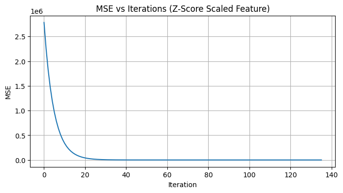

### Task 2

    Unscaled θ* (analytical): [2.21509616 2.99954023]
    Unscaled GD final θ:      [0.24181875 3.00254587]
    Learning rate (unscaled): 1e-06
    Converged in: NOT converged (200k iters limit) iterations
    
    Scaled θ* (analytical):   [1412.54114977  887.85858784]
    Scaled GD final θ:        [1412.54030453  887.85805656]
    Learning rate (scaled):   0.05
    Converged in: 136 iterations
    
    Feature mean (μx): 470.1807, std (σx): 295.9982
    

    

    

    

    

When gradient descent is applied without feature scaling, features with large magnitudes dominate the cost function, creating an elongated, poorly conditioned loss surface. This causes gradient updates to be uneven—small steps along shallow directions and zigzagging along steep ones—forcing the use of an extremely small learning rate and resulting in very slow or failed convergence. Applying z-score normalization rescales all features to a similar range, transforming the cost surface into a more symmetric, well-conditioned shape. This allows gradient descent to take balanced, stable steps in all directions, use a larger learning rate safely, and converge rapidly. In essence, feature scaling significantly improves both the speed and stability of gradient-based optimization by making the loss landscape more conducive to efficient learning.
